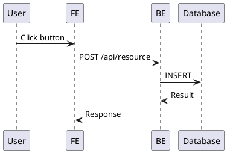
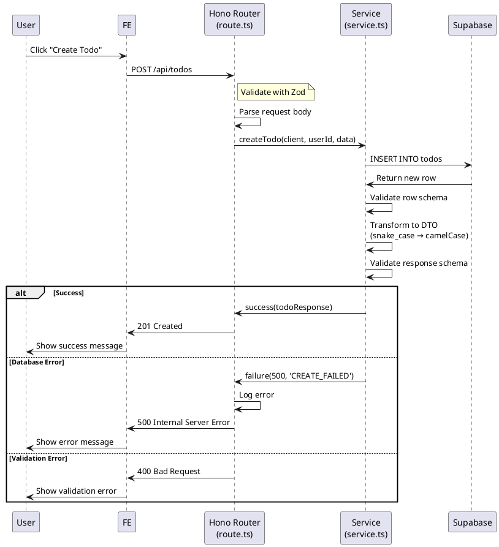
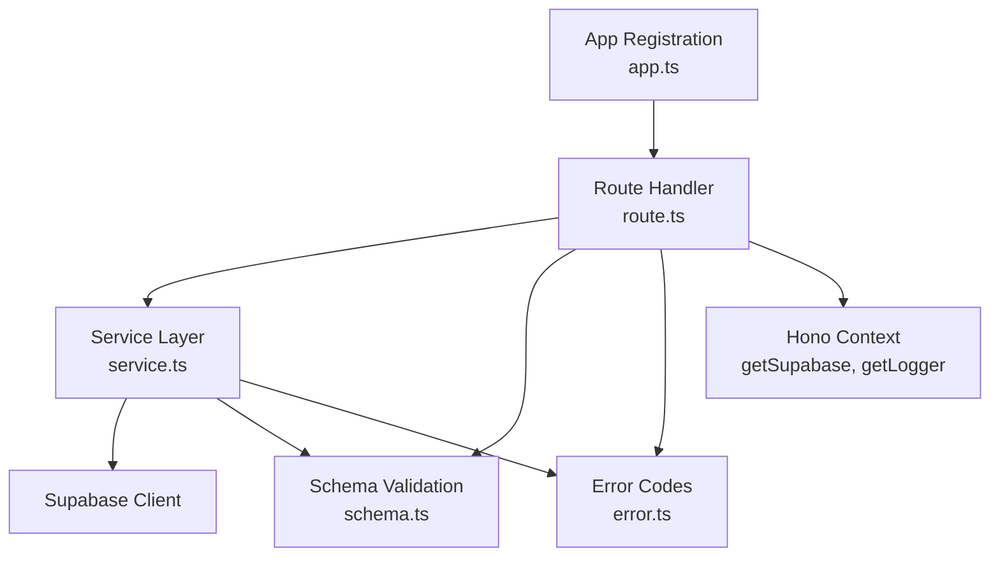

# Hono + Supabase Backend Integration Guide

이 가이드는 spec_to_plan 워크플로우에서 **Hono + Next.js + Supabase 아키텍처**를 어떻게 설계하고 문서화해야 하는지 구체적인 지침을 제공합니다.

---

## 목차

1. [아키텍처 개요](#아키텍처-개요)
2. [Phase별 Hono 통합 가이드](#phase별-hono-통합-가이드)
3. [Backend 모듈 구현 템플릿](#backend-모듈-구현-템플릿)
4. [공통 패턴 및 베스트 프랙티스](#공통-패턴-및-베스트-프랙티스)
5. [Migration과의 연동](#migration과의-연동)
6. [실전 체크리스트](#실전-체크리스트)

---

## 아키텍처 개요

### 레이어 구조

```
┌─────────────────────────────────────┐
│   Next.js Route Handler             │
│   (src/app/api/[[...hono]]/route.ts)│
│   - runtime = 'nodejs'              │
│   - service-role key 사용           │
└──────────────┬──────────────────────┘
               │ delegates to
┌──────────────▼──────────────────────┐
│   Hono Application                  │
│   (src/backend/hono/app.ts)         │
│   - errorBoundary()                 │
│   - withAppContext()                │
│   - withSupabase()                  │
│   - Feature Routes Registration     │
└──────────────┬──────────────────────┘
               │ routes to
┌──────────────▼──────────────────────┐
│   Feature Backend Modules           │
│   (src/features/[name]/backend/)    │
│   ├── route.ts    (HTTP Layer)      │
│   ├── service.ts  (Business Logic)  │
│   ├── schema.ts   (Validation)      │
│   └── error.ts    (Error Codes)     │
└──────────────┬──────────────────────┘
               │ uses
┌──────────────▼──────────────────────┐
│   Supabase Client                   │
│   (service-role key)                │
└─────────────────────────────────────┘
```

### 핵심 원칙

1. **싱글턴 패턴**: Hono 앱은 `createHonoApp()`에서 싱글턴으로 관리
2. **미들웨어 체인**: errorBoundary → withAppContext → withSupabase 순서 고수
3. **기능별 분리**: 각 feature는 독립적인 backend 디렉토리 보유
4. **Result 패턴**: 예외 대신 `HandlerResult<T, E, M>` 사용
5. **Context 주입**: `getSupabase(c)`, `getLogger(c)`, `c.get('config')` 사용

---

## Phase별 Hono 통합 가이드

### Phase 1: Database Schema

**변경사항 없음** - 기존 가이드 그대로 진행

- `/docs/database.md` 작성
- `/supabase/migrations/*.sql` 생성

### Phase 2: Use Cases

Use Case 작성 시 **Backend API 명세를 명확히 포함**합니다.

#### ✅ Sequence Diagram 개선

기존 "BE" 레이어를 **Hono Router**와 **Service**로 세분화하여 실제 구현 구조를 반영합니다.

**개선 전:**


**개선 후:**


#### ✅ Business Rules 확장

Use Case의 Business Rules 섹션에 **Backend API 명세 추가**:

```markdown
## Business Rules

### Validation Rules
- Title은 필수이며 최대 200자
- Description은 선택 사항

### API Specification
- **Endpoint**: `POST /api/todos`
- **Request Schema**: `CreateTodoRequestSchema`
  ```typescript
  {
    title: string (1-200 chars),
    description?: string
  }
  ```
- **Response Schema**: `TodoResponseSchema`
  ```typescript
  {
    id: string,
    userId: string,
    title: string,
    description: string | null,
    isCompleted: boolean,
    createdAt: string,
    updatedAt: string
  }
  ```
- **Error Codes**:
  - `INVALID_REQUEST` (400): 요청 검증 실패
  - `TODO_CREATE_FAILED` (500): 데이터베이스 오류
  - `TODO_VALIDATION_ERROR` (500): 스키마 검증 실패

### Database Operations
- Table: `todos`
- Operation: INSERT
- RLS: Disabled (service-role key 사용)
```

### Phase 3: State Management

**변경사항 없음** - Frontend 중심이므로 기존 가이드 그대로 진행

### Phase 4: Implementation Plan - Backend 모듈 설계

Implementation Plan 작성 시 **Backend 모듈을 구체적으로 나열**합니다.

#### 모듈 개요 예시

```markdown
## Overview

| Module | Location | Description |
|--------|----------|-------------|
| Zod Schema | `src/features/todos/backend/schema.ts` | Request/Response/Row 스키마 정의 |
| Error Codes | `src/features/todos/backend/error.ts` | 기능별 에러 코드 상수 |
| Service Layer | `src/features/todos/backend/service.ts` | Supabase 접근 및 비즈니스 로직 |
| Route Handler | `src/features/todos/backend/route.ts` | HTTP 요청 처리 및 검증 |
| App Registration | `src/backend/hono/app.ts` | Hono 앱에 라우터 등록 |
```

#### Diagram 예시



---

## Backend 모듈 구현 템플릿

각 모듈의 구체적인 구현 패턴과 테스트 항목을 정의합니다.

### 모듈 1: Zod Schema (`schema.ts`)

#### 책임
- Request body 스키마 정의
- Database row 스키마 정의 (snake_case)
- Response DTO 스키마 정의 (camelCase)
- TypeScript 타입 export

#### 구현 패턴

```typescript
import { z } from 'zod';

// ============================================
// Request Schema (camelCase)
// ============================================
export const CreateTodoRequestSchema = z.object({
  title: z.string().min(1).max(200),
  description: z.string().optional(),
});

export type CreateTodoRequest = z.infer<typeof CreateTodoRequestSchema>;

// ============================================
// Database Row Schema (snake_case)
// ============================================
export const TodoRowSchema = z.object({
  id: z.string().uuid(),
  user_id: z.string().uuid(),
  title: z.string(),
  description: z.string().nullable(),
  is_completed: z.boolean(),
  created_at: z.string(),
  updated_at: z.string(),
});

export type TodoRow = z.infer<typeof TodoRowSchema>;

// ============================================
// Response Schema (camelCase)
// ============================================
export const TodoResponseSchema = z.object({
  id: z.string(),
  userId: z.string(),
  title: z.string(),
  description: z.string().nullable(),
  isCompleted: z.boolean(),
  createdAt: z.string(),
  updatedAt: z.string(),
});

export type TodoResponse = z.infer<typeof TodoResponseSchema>;
```

#### Implementation Plan 작성 시

```markdown
### Module 1: Zod Schema Definition
**Location**: `src/features/todos/backend/schema.ts`

**Responsibilities**:
- Define `CreateTodoRequestSchema` (camelCase)
- Define `TodoRowSchema` (snake_case, matches database)
- Define `TodoResponseSchema` (camelCase, DTO for frontend)
- Export all types

**Unit Tests**: N/A (Schema definitions don't need tests)
```

---

### 모듈 2: Error Codes (`error.ts`)

#### 책임
- 기능별 에러 코드 상수 정의
- 타입 안전성 제공

#### 구현 패턴

```typescript
export const todoErrorCodes = {
  validationError: 'TODO_VALIDATION_ERROR',
  notFound: 'TODO_NOT_FOUND',
  createFailed: 'TODO_CREATE_FAILED',
  updateFailed: 'TODO_UPDATE_FAILED',
  deleteFailed: 'TODO_DELETE_FAILED',
  fetchError: 'TODO_FETCH_ERROR',
} as const;

export type TodoServiceError =
  (typeof todoErrorCodes)[keyof typeof todoErrorCodes];
```

#### Implementation Plan 작성 시

```markdown
### Module 2: Error Code Definition
**Location**: `src/features/todos/backend/error.ts`

**Responsibilities**:
- Define error code constants with `as const`
- Export `TodoServiceError` type

**Error Codes**:
- `TODO_VALIDATION_ERROR`: Schema validation failure
- `TODO_NOT_FOUND`: Resource not found
- `TODO_CREATE_FAILED`: Database insert failure
- `TODO_UPDATE_FAILED`: Database update failure
- `TODO_DELETE_FAILED`: Database delete failure
- `TODO_FETCH_ERROR`: Database query failure

**Unit Tests**: N/A (Constant definitions)
```

---

### 모듈 3: Service Layer (`service.ts`)

#### 책임
- Supabase 클라이언트로 데이터베이스 접근
- Business logic 수행
- snake_case → camelCase 변환
- Schema 검증 (Row, Response)
- `HandlerResult<T, E, M>` 반환

#### 구현 패턴

```typescript
import type { SupabaseClient } from '@supabase/supabase-js';
import {
  success,
  failure,
  type HandlerResult,
} from '@/backend/http/response';
import {
  CreateTodoRequestSchema,
  TodoRowSchema,
  TodoResponseSchema,
  type CreateTodoRequest,
  type TodoRow,
  type TodoResponse,
} from './schema';
import { todoErrorCodes, type TodoServiceError } from './error';

const TODOS_TABLE = 'todos';

export const createTodo = async (
  client: SupabaseClient,
  userId: string,
  data: CreateTodoRequest,
): Promise<HandlerResult<TodoResponse, TodoServiceError, unknown>> => {
  // 1. Database Insert (snake_case)
  const { data: row, error } = await client
    .from(TODOS_TABLE)
    .insert({
      user_id: userId,
      title: data.title,
      description: data.description ?? null,
    })
    .select()
    .single<TodoRow>();

  // 2. Handle Database Error
  if (error) {
    return failure(500, todoErrorCodes.createFailed, error.message);
  }

  // 3. Validate Row Schema
  const rowParse = TodoRowSchema.safeParse(row);
  if (!rowParse.success) {
    return failure(
      500,
      todoErrorCodes.validationError,
      'Todo row failed validation.',
      rowParse.error.format(),
    );
  }

  // 4. Transform to DTO (snake_case → camelCase)
  const dto: TodoResponse = {
    id: rowParse.data.id,
    userId: rowParse.data.user_id,
    title: rowParse.data.title,
    description: rowParse.data.description,
    isCompleted: rowParse.data.is_completed,
    createdAt: rowParse.data.created_at,
    updatedAt: rowParse.data.updated_at,
  };

  // 5. Validate Response Schema
  const parsed = TodoResponseSchema.safeParse(dto);
  if (!parsed.success) {
    return failure(
      500,
      todoErrorCodes.validationError,
      'Todo response failed validation.',
      parsed.error.format(),
    );
  }

  // 6. Return Success
  return success(parsed.data);
};
```

#### Implementation Plan 작성 시

```markdown
### Module 3: Service Layer
**Location**: `src/features/todos/backend/service.ts`

**Responsibilities**:
- Accept `SupabaseClient` as parameter
- Execute database operations (INSERT/SELECT/UPDATE/DELETE)
- Validate database row with `TodoRowSchema`
- Transform snake_case → camelCase
- Validate response DTO with `TodoResponseSchema`
- Return `HandlerResult<TodoResponse, TodoServiceError, unknown>`

**Function Signature**:
```typescript
createTodo(
  client: SupabaseClient,
  userId: string,
  data: CreateTodoRequest
): Promise<HandlerResult<TodoResponse, TodoServiceError, unknown>>
```

**Unit Tests**:
```typescript
describe('createTodo', () => {
  it('should successfully create todo and return DTO', async () => {
    // Mock Supabase insert → success path
  })

  it('should return failure on database error', async () => {
    // Mock Supabase insert → error
  })

  it('should return failure on row validation error', async () => {
    // Mock Supabase insert → invalid row schema
  })

  it('should return failure on response validation error', async () => {
    // Mock transformation → invalid response schema
  })

  it('should correctly transform snake_case to camelCase', async () => {
    // Verify field mapping
  })
})
```
```

---

### 모듈 4: Route Handler (`route.ts`)

#### 책임
- HTTP 요청 파싱
- Request schema 검증 (Zod)
- Context에서 의존성 주입 (Supabase, Logger)
- Service 호출
- 에러 로깅
- `respond()` 헬퍼로 응답 반환

#### 구현 패턴

```typescript
import type { Hono } from 'hono';
import {
  respond,
  failure,
  type ErrorResult,
} from '@/backend/http/response';
import {
  getSupabase,
  getLogger,
  type AppEnv,
} from '@/backend/hono/context';
import { CreateTodoRequestSchema } from './schema';
import { createTodo } from './service';
import { todoErrorCodes, type TodoServiceError } from './error';

export const registerTodoRoutes = (app: Hono<AppEnv>) => {
  // Create Todo
  app.post('/todos', async (c) => {
    // 1. Parse and Validate Request Body
    const body = await c.req.json();
    const parsed = CreateTodoRequestSchema.safeParse(body);

    if (!parsed.success) {
      return respond(
        c,
        failure(
          400,
          'INVALID_REQUEST',
          'The request body is invalid.',
          parsed.error.format(),
        ),
      );
    }

    // 2. Get Dependencies from Context
    const supabase = getSupabase(c);
    const logger = getLogger(c);

    // TODO: Get userId from authentication
    const userId = 'user-id-placeholder';

    // 3. Call Service
    const result = await createTodo(supabase, userId, parsed.data);

    // 4. Handle Errors with Logging
    if (!result.ok) {
      const errorResult = result as ErrorResult<TodoServiceError, unknown>;

      if (errorResult.error.code === todoErrorCodes.createFailed) {
        logger.error('Failed to create todo', errorResult.error.message);
      } else if (errorResult.error.code === todoErrorCodes.validationError) {
        logger.error('Todo validation failed', errorResult.error.message);
      }
    }

    // 5. Return Response
    return respond(c, result);
  });
};
```

#### Implementation Plan 작성 시

```markdown
### Module 4: Route Handler
**Location**: `src/features/todos/backend/route.ts`

**Responsibilities**:
- Parse HTTP request (body, params, query)
- Validate request with Zod schema
- Get `supabase` and `logger` from Hono context
- Call service function
- Log errors appropriately
- Return response using `respond()` helper

**Endpoints**:
- `POST /todos` - Create new todo

**QA Sheet**:
- [ ] POST /api/todos with valid body returns 201
- [ ] POST /api/todos with invalid body returns 400
- [ ] POST /api/todos with missing title returns 400 with validation details
- [ ] Service error returns 500 and logs to console
- [ ] Response matches `TodoResponseSchema`
- [ ] Error response includes error code and message
```

---

### 모듈 5: App Registration (`app.ts`)

#### 책임
- Feature router를 Hono 앱에 등록

#### 구현 패턴

```typescript
import { Hono } from 'hono';
import { errorBoundary } from '@/backend/middleware/error';
import { withAppContext } from '@/backend/middleware/context';
import { withSupabase } from '@/backend/middleware/supabase';
import { registerExampleRoutes } from '@/features/example/backend/route';
import { registerTodoRoutes } from '@/features/todos/backend/route'; // 추가
import type { AppEnv } from '@/backend/hono/context';

let singletonApp: Hono<AppEnv> | null = null;

export const createHonoApp = () => {
  if (singletonApp) {
    return singletonApp;
  }

  const app = new Hono<AppEnv>();

  // Middleware 순서 중요!
  app.use('*', errorBoundary());
  app.use('*', withAppContext());
  app.use('*', withSupabase());

  // Feature Routes
  registerExampleRoutes(app);
  registerTodoRoutes(app); // 추가

  singletonApp = app;

  return app;
};
```

#### Implementation Plan 작성 시

```markdown
### Module 5: App Registration
**Location**: `src/backend/hono/app.ts`

**Responsibilities**:
- Import `registerTodoRoutes` from feature backend
- Call `registerTodoRoutes(app)` after existing routes

**Changes**:
```typescript
import { registerTodoRoutes } from '@/features/todos/backend/route';

// ... existing middleware ...

registerExampleRoutes(app);
registerTodoRoutes(app); // Add this line
```

**QA**:
- [ ] Routes are accessible at `/api/todos`
- [ ] Middleware chain applies to todo routes
- [ ] No route conflicts with existing features
```

---

## 공통 패턴 및 베스트 프랙티스

### ✅ DO: 따라야 할 패턴

#### 1. 항상 Zod로 검증
```typescript
// ✅ Good
const parsed = CreateTodoRequestSchema.safeParse(body);
if (!parsed.success) {
  return respond(c, failure(400, 'INVALID_REQUEST', 'Validation failed'));
}

// ❌ Bad: 검증 없이 타입 단언
const data = body as CreateTodoRequest;
```

#### 2. HandlerResult 패턴 사용
```typescript
// ✅ Good
export const createTodo = async (
  client: SupabaseClient,
  data: CreateTodoRequest
): Promise<HandlerResult<TodoResponse, TodoServiceError, unknown>> => {
  // ...
  if (error) {
    return failure(500, 'CREATE_FAILED', error.message);
  }
  return success(todoResponse);
};

// ❌ Bad: 예외 던지기
export const createTodo = async (
  client: SupabaseClient,
  data: CreateTodoRequest
): Promise<TodoResponse> => {
  if (error) {
    throw new Error('Create failed'); // 안티패턴
  }
  return todoResponse;
};
```

#### 3. snake_case ↔ camelCase 변환
```typescript
// ✅ Good: Service에서 명시적 변환
const dto: TodoResponse = {
  id: rowParse.data.id,
  userId: rowParse.data.user_id, // snake → camel
  isCompleted: rowParse.data.is_completed,
  createdAt: rowParse.data.created_at,
};

// ❌ Bad: 변환 없이 그대로 반환
return success(rowParse.data); // Frontend에 snake_case 노출
```

#### 4. 에러 로깅
```typescript
// ✅ Good: Route에서 로깅
const result = await createTodo(supabase, userId, data);
if (!result.ok) {
  logger.error('Failed to create todo', result.error);
}

// ❌ Bad: Service에서 로깅 (Service는 순수 로직만)
export const createTodo = async (...) => {
  if (error) {
    console.error('Failed'); // Service에서 직접 로깅 금지
    return failure(...);
  }
};
```

#### 5. Context에서 의존성 주입
```typescript
// ✅ Good
const supabase = getSupabase(c);
const logger = getLogger(c);
const config = c.get('config');

// ❌ Bad: 직접 접근
const supabase = c.env.SUPABASE_CLIENT; // c.env 직접 접근 금지
```

### ❌ DON'T: 피해야 할 안티패턴

#### 1. 직접 c.json() 반환 금지
```typescript
// ❌ Bad
return c.json({ data: todo }, 201);

// ✅ Good
return respond(c, success(todo));
```

#### 2. c.env 직접 접근 금지
```typescript
// ❌ Bad
const apiKey = c.env.API_KEY;

// ✅ Good
const config = c.get('config');
const apiKey = config.apiKey;
```

#### 3. Service에서 HTTP 상태 코드 결정 금지
```typescript
// ❌ Bad: Service가 HTTP 알면 안 됨
return failure(404, 'NOT_FOUND', 'Not found'); // 404는 HTTP 개념

// ✅ Good: Service는 비즈니스 에러만
return failure(500, 'NOT_FOUND', 'Not found'); // Route에서 404로 매핑
```

#### 4. 예외(throw) 대신 Result 패턴 사용
```typescript
// ❌ Bad
if (!data) {
  throw new Error('Not found');
}

// ✅ Good
if (!data) {
  return failure(500, 'NOT_FOUND', 'Resource not found');
}
```

---

## Migration과의 연동

### Database Schema → Backend Schema 매핑

Phase 1에서 생성한 SQL migration과 Backend schema를 일치시킵니다.

#### 예시: Todo 테이블

**Migration**: `supabase/migrations/002_create_todos_table.sql`
```sql
CREATE TABLE IF NOT EXISTS todos (
  id UUID PRIMARY KEY DEFAULT gen_random_uuid(),
  user_id UUID NOT NULL REFERENCES auth.users(id) ON DELETE CASCADE,
  title VARCHAR(200) NOT NULL,
  description TEXT,
  is_completed BOOLEAN DEFAULT FALSE,
  created_at TIMESTAMP DEFAULT NOW(),
  updated_at TIMESTAMP DEFAULT NOW()
);

CREATE INDEX IF NOT EXISTS idx_todos_user_id
  ON todos(user_id, created_at DESC);

CREATE TRIGGER todos_updated_at
  BEFORE UPDATE ON todos
  FOR EACH ROW
  EXECUTE FUNCTION update_updated_at();
```

**Backend Schema**: `src/features/todos/backend/schema.ts`
```typescript
export const TodoRowSchema = z.object({
  id: z.string().uuid(),              // UUID → string
  user_id: z.string().uuid(),         // UUID → string
  title: z.string(),                  // VARCHAR(200) → string
  description: z.string().nullable(), // TEXT → string | null
  is_completed: z.boolean(),          // BOOLEAN → boolean
  created_at: z.string(),             // TIMESTAMP → ISO string
  updated_at: z.string(),             // TIMESTAMP → ISO string
});
```

### 매핑 규칙

| SQL Type | Supabase Type | Zod Type | TypeScript Type |
|----------|---------------|----------|-----------------|
| UUID | `uuid` | `z.string().uuid()` | `string` |
| VARCHAR(N) | `text` | `z.string()` | `string` |
| TEXT | `text` | `z.string()` | `string` |
| BOOLEAN | `boolean` | `z.boolean()` | `boolean` |
| INTEGER | `int4` | `z.number().int()` | `number` |
| TIMESTAMP | `timestamp` | `z.string()` | `string` (ISO 8601) |
| NULL | `null` | `.nullable()` | `T \| null` |

---

## 실전 체크리스트

Phase 4 (Implementation Plan) 작성 후, 실제 구현 시 확인하세요.

### Schema (schema.ts)
- [ ] Request Schema 정의 (Zod, camelCase)
- [ ] Database Row Schema 정의 (Zod, snake_case)
- [ ] Response DTO Schema 정의 (Zod, camelCase)
- [ ] 모든 타입 export (`z.infer<typeof ...>`)
- [ ] Schema가 migration SQL과 일치

### Error Codes (error.ts)
- [ ] 기능별 에러 코드 정의
- [ ] `as const` 사용
- [ ] 타입 정의 export (`typeof ... [keyof typeof ...]`)

### Service (service.ts)
- [ ] `SupabaseClient`를 파라미터로 받음
- [ ] `HandlerResult<T, E, M>` 반환
- [ ] Row 검증 (Zod `safeParse`)
- [ ] DTO 변환 (snake_case → camelCase)
- [ ] DTO 검증 (Zod `safeParse`)
- [ ] 에러 시 `failure()` 반환
- [ ] 성공 시 `success()` 반환
- [ ] Unit test 작성 (최소 3개 시나리오)

### Route (route.ts)
- [ ] Request 파싱 및 검증 (Zod)
- [ ] `getSupabase(c)` 사용
- [ ] `getLogger(c)` 사용
- [ ] Service 호출
- [ ] 에러 발생 시 로깅
- [ ] `respond()` 헬퍼 사용
- [ ] Integration test 작성 (E2E)

### App Registration (app.ts)
- [ ] `registerXxxRoutes(app)` 추가
- [ ] 라우트 순서 고려 (와일드카드 주의)
- [ ] Import 경로 확인

### Migration (supabase/migrations/*.sql)
- [ ] 테이블 생성 (CREATE TABLE IF NOT EXISTS)
- [ ] 인덱스 추가 (CREATE INDEX IF NOT EXISTS)
- [ ] Trigger 설정 (updated_at 자동 갱신)
- [ ] RLS 비활성화 (service-role key 사용)

### 통합 테스트
- [ ] API 엔드포인트 접근 가능 (curl/Postman)
- [ ] 유효한 요청 시 정상 응답
- [ ] 유효하지 않은 요청 시 400 응답
- [ ] Database 오류 시 500 응답
- [ ] 로그가 콘솔에 출력됨

---

## 예제: Create Todo 전체 흐름

### 1. Migration
```sql
-- supabase/migrations/002_create_todos.sql
CREATE TABLE todos (
  id UUID PRIMARY KEY DEFAULT gen_random_uuid(),
  user_id UUID NOT NULL,
  title VARCHAR(200) NOT NULL,
  description TEXT,
  is_completed BOOLEAN DEFAULT FALSE,
  created_at TIMESTAMP DEFAULT NOW(),
  updated_at TIMESTAMP DEFAULT NOW()
);
```

### 2. Schema
```typescript
// src/features/todos/backend/schema.ts
export const CreateTodoRequestSchema = z.object({
  title: z.string().min(1).max(200),
  description: z.string().optional(),
});

export const TodoRowSchema = z.object({
  id: z.string().uuid(),
  user_id: z.string().uuid(),
  title: z.string(),
  description: z.string().nullable(),
  is_completed: z.boolean(),
  created_at: z.string(),
  updated_at: z.string(),
});

export const TodoResponseSchema = z.object({
  id: z.string(),
  userId: z.string(),
  title: z.string(),
  description: z.string().nullable(),
  isCompleted: z.boolean(),
  createdAt: z.string(),
  updatedAt: z.string(),
});
```

### 3. Error Codes
```typescript
// src/features/todos/backend/error.ts
export const todoErrorCodes = {
  validationError: 'TODO_VALIDATION_ERROR',
  createFailed: 'TODO_CREATE_FAILED',
} as const;

export type TodoServiceError =
  (typeof todoErrorCodes)[keyof typeof todoErrorCodes];
```

### 4. Service
```typescript
// src/features/todos/backend/service.ts
export const createTodo = async (
  client: SupabaseClient,
  userId: string,
  data: CreateTodoRequest,
): Promise<HandlerResult<TodoResponse, TodoServiceError, unknown>> => {
  const { data: row, error } = await client
    .from('todos')
    .insert({ user_id: userId, ...data })
    .select()
    .single<TodoRow>();

  if (error) return failure(500, todoErrorCodes.createFailed, error.message);

  const rowParse = TodoRowSchema.safeParse(row);
  if (!rowParse.success) {
    return failure(500, todoErrorCodes.validationError, 'Row validation failed');
  }

  const dto: TodoResponse = {
    id: rowParse.data.id,
    userId: rowParse.data.user_id,
    title: rowParse.data.title,
    description: rowParse.data.description,
    isCompleted: rowParse.data.is_completed,
    createdAt: rowParse.data.created_at,
    updatedAt: rowParse.data.updated_at,
  };

  const parsed = TodoResponseSchema.safeParse(dto);
  if (!parsed.success) {
    return failure(500, todoErrorCodes.validationError, 'DTO validation failed');
  }

  return success(parsed.data);
};
```

### 5. Route
```typescript
// src/features/todos/backend/route.ts
export const registerTodoRoutes = (app: Hono<AppEnv>) => {
  app.post('/todos', async (c) => {
    const body = await c.req.json();
    const parsed = CreateTodoRequestSchema.safeParse(body);

    if (!parsed.success) {
      return respond(c, failure(400, 'INVALID_REQUEST', 'Validation failed'));
    }

    const supabase = getSupabase(c);
    const logger = getLogger(c);
    const result = await createTodo(supabase, 'user-id', parsed.data);

    if (!result.ok) {
      logger.error('Failed to create todo', result.error);
    }

    return respond(c, result);
  });
};
```

### 6. App Registration
```typescript
// src/backend/hono/app.ts
import { registerTodoRoutes } from '@/features/todos/backend/route';

// ...
registerTodoRoutes(app);
```

---

## 마무리

이 가이드를 spec_to_plan 워크플로우와 함께 사용하면:

1. ✅ **명확한 구조**: Phase 2, 4에서 Hono 아키텍처 반영
2. ✅ **일관된 패턴**: 모든 feature가 동일한 구조 유지
3. ✅ **타입 안전성**: Zod + TypeScript로 런타임/컴파일 타임 검증
4. ✅ **에러 처리**: Result 패턴으로 예측 가능한 에러 흐름
5. ✅ **테스트 가능**: 각 레이어가 독립적으로 테스트 가능

**다음 단계**: 실제 Use Case 작성 시 이 가이드를 참고하여 Backend API 명세를 포함하세요!
