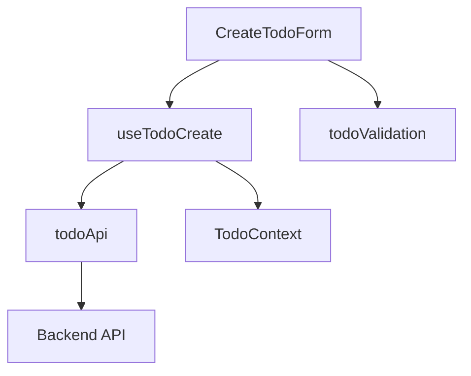

# Workflow Examples

Complete examples demonstrating each phase of the spec-based web development workflow.

## Example Project: Simple Todo Application

This example shows how to apply the workflow to build a basic todo application.

---

## Phase 1: Database Schema Example

### Input Files

**`/docs/prd.md`** (excerpt):
```markdown
# Todo Application

Users can create, view, update, and delete todo items. Each todo has a title, description, and completion status.
```

**`/docs/userflow.md`** (excerpt):
```markdown
1. User signs up / logs in
2. User views todo list
3. User creates new todo (title, description)
4. User marks todo as complete
5. User deletes todo
```

### Output: `/docs/database.md`

```markdown
# Database Schema

## Data Flow

```
User Authentication → User Profile
User Profile → Todo Items (1:N relationship)
Todo Items → Status Updates
```

## PostgreSQL Schema

### users
| Column | Type | Constraints |
|--------|------|-------------|
| id | UUID | PRIMARY KEY, DEFAULT gen_random_uuid() |
| email | VARCHAR(255) | UNIQUE, NOT NULL |
| created_at | TIMESTAMP | DEFAULT NOW() |

### todos
| Column | Type | Constraints |
|--------|------|-------------|
| id | UUID | PRIMARY KEY, DEFAULT gen_random_uuid() |
| user_id | UUID | FOREIGN KEY REFERENCES users(id), NOT NULL |
| title | VARCHAR(200) | NOT NULL |
| description | TEXT | |
| is_completed | BOOLEAN | DEFAULT FALSE |
| created_at | TIMESTAMP | DEFAULT NOW() |
| updated_at | TIMESTAMP | DEFAULT NOW() |

### Indexes
- todos(user_id, created_at DESC) - For efficient todo list queries
```

### Output: `/supabase/migrations/001_initial_schema.sql`

```sql
-- Enable UUID extension
CREATE EXTENSION IF NOT EXISTS "uuid-ossp";

-- Users table
CREATE TABLE users (
    id UUID PRIMARY KEY DEFAULT gen_random_uuid(),
    email VARCHAR(255) UNIQUE NOT NULL,
    created_at TIMESTAMP DEFAULT NOW()
);

-- Todos table
CREATE TABLE todos (
    id UUID PRIMARY KEY DEFAULT gen_random_uuid(),
    user_id UUID NOT NULL REFERENCES users(id) ON DELETE CASCADE,
    title VARCHAR(200) NOT NULL,
    description TEXT,
    is_completed BOOLEAN DEFAULT FALSE,
    created_at TIMESTAMP DEFAULT NOW(),
    updated_at TIMESTAMP DEFAULT NOW()
);

-- Indexes
CREATE INDEX idx_todos_user_created ON todos(user_id, created_at DESC);

-- Update timestamp trigger
CREATE OR REPLACE FUNCTION update_updated_at()
RETURNS TRIGGER AS $$
BEGIN
    NEW.updated_at = NOW();
    RETURN NEW;
END;
$$ LANGUAGE plpgsql;

CREATE TRIGGER todos_updated_at
    BEFORE UPDATE ON todos
    FOR EACH ROW
    EXECUTE FUNCTION update_updated_at();
```

---

## Phase 2: Use Case Example

### Input: Feature #3 from userflow.md

```
3. User creates new todo (title, description)
```

### Output: `/docs/003/spec.md`

```markdown
# Use Case: Create New Todo

## Primary Actor
Authenticated User

## Precondition
- User is logged in
- User is on the todo list page

## Trigger
User clicks "New Todo" button

## Main Scenario
1. User clicks "New Todo" button
2. System displays todo creation form
3. User enters title (required)
4. User enters description (optional)
5. User clicks "Create" button
6. System validates input
7. System creates todo in database
8. System displays success message
9. System refreshes todo list with new item

## Edge Cases

### Empty Title
- **Scenario**: User submits without title
- **Handling**: Display validation error, prevent submission

### Network Error
- **Scenario**: Request fails due to connectivity
- **Handling**: Display error message, allow retry

### Duplicate Title
- **Scenario**: User creates todo with existing title
- **Handling**: Allow duplicate titles (no restriction)

## Business Rules
- Title is required, max 200 characters
- Description is optional, no length limit
- New todos default to incomplete status
- Todos are associated with creating user

## Sequence Diagram

\`\`\`plantuml
@startuml
participant User
participant FE
participant BE
participant Database

User -> FE: Click "New Todo"
FE -> User: Display creation form

User -> FE: Enter title & description
User -> FE: Click "Create"

FE -> FE: Validate input
alt Invalid input
    FE -> User: Show validation error
else Valid input
    FE -> BE: POST /api/todos
    note right: {title, description, user_id}
    
    BE -> BE: Validate request
    BE -> Database: INSERT INTO todos
    Database -> BE: Return new todo
    
    BE -> FE: 201 Created {todo}
    FE -> User: Show success message
    FE -> FE: Refresh todo list
end
@enduml
\`\`\`
```

---

## Phase 3: State Management Example

### Input: Page name = "TodoList"

### Output: `/docs/pages/TodoList/requirement.md`

```markdown
# TodoList Page Requirements

## Page Overview
Display and manage user's todo items with create, update, and delete operations.

## User Actions & Data Flow

### View Todos
1. User lands on page
2. System fetches todos from database (GET /api/todos?user_id={id})
3. Display todos sorted by creation date (newest first)

### Create Todo
1. User clicks "New Todo"
2. User fills form (title, description)
3. System validates input
4. System creates todo (POST /api/todos)
5. Database stores new todo
6. System refreshes list

### Toggle Complete
1. User clicks checkbox on todo
2. System updates todo (PATCH /api/todos/{id})
3. Database updates is_completed field
4. System updates UI immediately (optimistic)

### Delete Todo
1. User clicks delete button
2. System shows confirmation
3. User confirms
4. System deletes todo (DELETE /api/todos/{id})
5. Database removes record
6. System removes from list

## Database Interactions
- **Read**: Fetch user's todos on page load
- **Create**: Insert new todo
- **Update**: Toggle completion status
- **Delete**: Remove todo
```

### Output: `/docs/pages/TodoList/state_management.md`

```markdown
# TodoList State Management

## State Data

### Managed State
- `todos`: Array<Todo> - List of user's todos
- `loading`: boolean - Data fetch status
- `error`: string | null - Error messages
- `filter`: 'all' | 'active' | 'completed' - Filter selection

### Derived/Display-Only Data
- `filteredTodos` - Computed from todos + filter
- `completedCount` - Computed from todos
- `activeCount` - Computed from todos

## State Transitions

| State | Change Condition | UI Update |
|-------|------------------|-----------|
| loading | Page mount → API call starts | Show loading spinner |
| loading | API call completes | Hide spinner, show todos |
| todos | User creates todo | Add to list, clear form |
| todos | User toggles complete | Update checkbox, strikethrough |
| todos | User deletes todo | Remove from list |
| error | API call fails | Display error banner |
| filter | User changes filter dropdown | Update visible todos |

## Flux Pattern Design

### Actions
```typescript
type Action =
  | { type: 'FETCH_START' }
  | { type: 'FETCH_SUCCESS', payload: Todo[] }
  | { type: 'FETCH_ERROR', payload: string }
  | { type: 'CREATE_TODO', payload: Todo }
  | { type: 'TOGGLE_TODO', payload: { id: string } }
  | { type: 'DELETE_TODO', payload: { id: string } }
  | { type: 'SET_FILTER', payload: FilterType }
```

### Store (useReducer)
```typescript
function todoReducer(state: State, action: Action): State {
  switch (action.type) {
    case 'FETCH_START':
      return { ...state, loading: true, error: null }
    
    case 'FETCH_SUCCESS':
      return { ...state, loading: false, todos: action.payload }
    
    case 'CREATE_TODO':
      return { ...state, todos: [action.payload, ...state.todos] }
    
    case 'TOGGLE_TODO':
      return {
        ...state,
        todos: state.todos.map(todo =>
          todo.id === action.payload.id
            ? { ...todo, is_completed: !todo.is_completed }
            : todo
        )
      }
    
    case 'DELETE_TODO':
      return {
        ...state,
        todos: state.todos.filter(todo => todo.id !== action.payload.id)
      }
    
    case 'SET_FILTER':
      return { ...state, filter: action.payload }
    
    default:
      return state
  }
}
```

### View
Components receive state and dispatch from Context, render UI based on state, and trigger actions via dispatch.

## Context Design

### Data Flow
```
TodoProvider (Context)
  ↓
useReducer (State Management)
  ↓
API Calls (Effects)
  ↓
Child Components (Consumers)
```

### Exposed Interface
```typescript
interface TodoContextValue {
  // State
  todos: Todo[]
  loading: boolean
  error: string | null
  filter: FilterType
  
  // Computed
  filteredTodos: Todo[]
  completedCount: number
  activeCount: number
  
  // Actions
  createTodo: (title: string, description?: string) => Promise<void>
  toggleTodo: (id: string) => Promise<void>
  deleteTodo: (id: string) => Promise<void>
  setFilter: (filter: FilterType) => void
  refreshTodos: () => Promise<void>
}
```

### Usage
```typescript
function TodoList() {
  const { filteredTodos, loading, createTodo } = useTodoContext()
  
  if (loading) return <Spinner />
  
  return (
    <div>
      <CreateTodoForm onSubmit={createTodo} />
      {filteredTodos.map(todo => <TodoItem key={todo.id} todo={todo} />)}
    </div>
  )
}
```
```

---

## Phase 4: Implementation Plan Example

### Feature-Based Plan

### Output: `/docs/usecases/003/plan.md`

```markdown
# Implementation Plan: Create Todo Feature

## Overview

| Module | Location | Description |
|--------|----------|-------------|
| CreateTodoForm | `src/features/todos/components/CreateTodoForm.tsx` | Form component with validation |
| useTodoCreate | `src/features/todos/hooks/useTodoCreate.ts` | Create logic hook |
| todoValidation | `src/features/todos/utils/validation.ts` | Input validation utils |
| todoApi | `src/features/todos/api/todoApi.ts` | API client methods |

## Diagram



## Implementation Plan

### 1. CreateTodoForm Component
**Location**: `src/features/todos/components/CreateTodoForm.tsx`

**Responsibilities**:
- Render form inputs (title, description)
- Handle user input
- Display validation errors
- Submit to create hook

**QA Sheet**:
- [ ] Title input renders correctly
- [ ] Description textarea renders correctly
- [ ] Submit button is enabled when title is valid
- [ ] Submit button is disabled when title is empty
- [ ] Validation errors display below inputs
- [ ] Form clears after successful submission
- [ ] Loading state disables form during submission
- [ ] Error message displays on submission failure

**Props**:
```typescript
interface CreateTodoFormProps {
  onSuccess?: () => void
}
```

### 2. useTodoCreate Hook
**Location**: `src/features/todos/hooks/useTodoCreate.ts`

**Responsibilities**:
- Validate input
- Call API
- Update context state
- Handle errors

**Unit Tests**:
```typescript
describe('useTodoCreate', () => {
  it('should validate title is required', async () => {
    // Test validation
  })
  
  it('should call API with correct payload', async () => {
    // Test API call
  })
  
  it('should update context on success', async () => {
    // Test state update
  })
  
  it('should handle API errors', async () => {
    // Test error handling
  })
})
```

### 3. todoValidation Utils
**Location**: `src/features/todos/utils/validation.ts`

**Responsibilities**:
- Validate title (required, max length)
- Validate description (optional)

**Unit Tests**:
```typescript
describe('validateTodoInput', () => {
  it('should reject empty title', () => {
    expect(validateTodoInput({ title: '' })).toHaveError()
  })
  
  it('should reject title over 200 chars', () => {
    expect(validateTodoInput({ title: 'x'.repeat(201) })).toHaveError()
  })
  
  it('should accept valid input', () => {
    expect(validateTodoInput({ title: 'Valid' })).toBeValid()
  })
})
```

### 4. todoApi Client
**Location**: `src/features/todos/api/todoApi.ts`

**Responsibilities**:
- POST /api/todos endpoint
- Handle HTTP errors
- Return typed response

**Unit Tests**:
```typescript
describe('todoApi.create', () => {
  it('should call correct endpoint', async () => {
    // Test endpoint
  })
  
  it('should send correct payload', async () => {
    // Test request body
  })
  
  it('should return created todo', async () => {
    // Test response
  })
  
  it('should throw on 4xx/5xx errors', async () => {
    // Test error handling
  })
})
```

## Implementation Order
1. todoValidation (no dependencies)
2. todoApi (no dependencies)
3. useTodoCreate (depends on #1, #2)
4. CreateTodoForm (depends on #3)
```

---

## Key Takeaways

1. **Documentation drives development** - Each phase produces concrete documentation that guides the next phase
2. **Progressive detail** - Start with high-level (database) and refine to implementation details (plan)
3. **Validation at each step** - Check outputs match expected structure before proceeding
4. **Reusability focus** - Implementation plans identify shared modules and patterns
5. **Test coverage** - Plans include QA sheets and unit tests from the start
