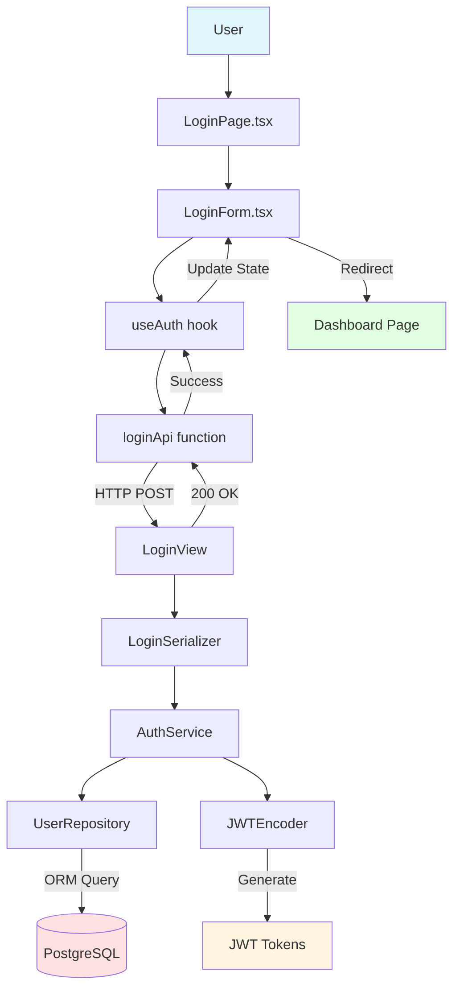

# UC-001: User Login - Implementation Plan (TDD)

## 개요

**목표**: Django REST Framework + React로 JWT 기반 로그인 시스템 구현
**방법론**: TDD (Red → Green → Refactor)
**핵심 기술**: Django Auth, DRF Simple JWT, TanStack Query, React Hook Form

---

## 1. Module Overview

### 1.1 Backend Modules

| 모듈 | 경로 | 역할 | 의존성 |
|------|------|------|--------|
| **LoginView** | `apps/authentication/views.py` | HTTP 요청/응답 처리 | LoginSerializer, AuthService |
| **LoginSerializer** | `apps/authentication/serializers.py` | 입력 검증 및 DTO | DRF Serializer |
| **AuthService** | `apps/authentication/services.py` | 비즈니스 로직 (인증, 토큰 생성) | UserRepository, JWTEncoder |
| **UserRepository** | `apps/authentication/repositories.py` | DB 액세스 (사용자 조회) | Django ORM (User model) |
| **JWTEncoder** | `apps/authentication/jwt.py` | JWT 토큰 생성/검증 | djangorestframework-simplejwt |

### 1.2 Frontend Modules

| 모듈 | 경로 | 역할 | 의존성 |
|------|------|------|--------|
| **LoginPage** | `components/pages/LoginPage.tsx` | 페이지 컨테이너 | LoginForm |
| **LoginForm** | `components/features/Auth/LoginForm.tsx` | 폼 렌더링 및 이벤트 | useAuth hook, react-hook-form |
| **useAuth** | `hooks/queries/useAuth.ts` | 로그인 mutation 관리 | TanStack Query, loginApi |
| **loginApi** | `api/endpoints/auth.api.ts` | API 통신 | axios client |

---

## 2. Dependency Diagram



---

## 3. TDD Implementation Order

### Phase 1: Backend - AuthService (Core Logic)
### Phase 2: Backend - LoginView (API Endpoint)
### Phase 3: Frontend - useAuth Hook (Data Fetching)
### Phase 4: Frontend - LoginForm Component (UI)
### Phase 5: E2E Tests (Full Flow)

---

## 4. Phase 1: Backend - AuthService

### 4.1 Test Scenarios (Unit Tests)

#### Test 1: 성공적인 로그인
```python
# path: backend/apps/authentication/tests/test_services.py

import pytest
from unittest.mock import MagicMock
from django.contrib.auth.hashers import make_password

from ..services import AuthService
from ..exceptions import AuthenticationFailed, AccountInactive, AccountLocked

@pytest.fixture
def mock_user_repository():
    """Mock UserRepository fixture"""
    return MagicMock()

@pytest.fixture
def mock_jwt_encoder():
    """Mock JWTEncoder fixture"""
    encoder = MagicMock()
    encoder.generate_tokens.return_value = {
        'access': 'fake_access_token',
        'refresh': 'fake_refresh_token'
    }
    return encoder

@pytest.fixture
def auth_service(mock_user_repository, mock_jwt_encoder):
    """AuthService with injected mocks"""
    service = AuthService()
    service.repository = mock_user_repository
    service.jwt_encoder = mock_jwt_encoder
    return service

def test_login_success(auth_service, mock_user_repository):
    # Given: 유효한 사용자 계정
    mock_user = MagicMock()
    mock_user.id = 1
    mock_user.username = 'admin_user'
    mock_user.password = make_password('SecurePassword123!')
    mock_user.full_name = 'Admin User'
    mock_user.role = 'admin'
    mock_user.is_active = True
    mock_user.is_locked = False

    mock_user_repository.get_by_username.return_value = mock_user

    # When: 로그인 시도
    result = auth_service.login(username='admin_user', password='SecurePassword123!')

    # Then: 토큰과 사용자 정보 반환
    assert result['access_token'] == 'fake_access_token'
    assert result['refresh_token'] == 'fake_refresh_token'
    assert result['user']['id'] == 1
    assert result['user']['username'] == 'admin_user'
    assert result['user']['role'] == 'admin'

    mock_user_repository.get_by_username.assert_called_once_with('admin_user')
```

#### Test 2: 존재하지 않는 사용자
```python
def test_login_user_not_found(auth_service, mock_user_repository):
    # Given: 사용자 없음
    mock_user_repository.get_by_username.return_value = None

    # When & Then: AuthenticationFailed 예외 발생
    with pytest.raises(AuthenticationFailed, match="아이디 또는 비밀번호가 일치하지 않습니다"):
        auth_service.login(username='nonexistent', password='password')
```

#### Test 3: 비밀번호 불일치
```python
def test_login_invalid_password(auth_service, mock_user_repository):
    # Given: 유효한 사용자, 잘못된 비밀번호
    mock_user = MagicMock()
    mock_user.password = make_password('CorrectPassword')
    mock_user.is_active = True
    mock_user.is_locked = False

    mock_user_repository.get_by_username.return_value = mock_user

    # When & Then: AuthenticationFailed 예외 발생
    with pytest.raises(AuthenticationFailed, match="아이디 또는 비밀번호가 일치하지 않습니다"):
        auth_service.login(username='user', password='WrongPassword')
```

#### Test 4: 비활성 계정
```python
def test_login_inactive_account(auth_service, mock_user_repository):
    # Given: 비활성 계정
    mock_user = MagicMock()
    mock_user.password = make_password('password')
    mock_user.is_active = False
    mock_user.is_locked = False

    mock_user_repository.get_by_username.return_value = mock_user

    # When & Then: AccountInactive 예외 발생
    with pytest.raises(AccountInactive, match="비활성된 계정입니다"):
        auth_service.login(username='user', password='password')
```

#### Test 5: 잠금 계정
```python
def test_login_locked_account(auth_service, mock_user_repository):
    # Given: 잠금 계정
    mock_user = MagicMock()
    mock_user.password = make_password('password')
    mock_user.is_active = True
    mock_user.is_locked = True

    mock_user_repository.get_by_username.return_value = mock_user

    # When & Then: AccountLocked 예외 발생
    with pytest.raises(AccountLocked, match="계정이 잠겨있습니다"):
        auth_service.login(username='user', password='password')
```

### 4.2 Implementation (AuthService)

```python
# path: backend/apps/authentication/services.py

from typing import Dict, Any
from django.contrib.auth.hashers import check_password

from .repositories import UserRepository
from .jwt import JWTEncoder
from .exceptions import AuthenticationFailed, AccountInactive, AccountLocked

class AuthService:
    """
    비즈니스 로직: 사용자 인증 및 JWT 토큰 생성
    """
    def __init__(self):
        self.repository = UserRepository()
        self.jwt_encoder = JWTEncoder()

    def login(self, username: str, password: str) -> Dict[str, Any]:
        """
        사용자 로그인

        Args:
            username: 사용자명
            password: 비밀번호

        Returns:
            {
                'access_token': str,
                'refresh_token': str,
                'user': {
                    'id': int,
                    'username': str,
                    'full_name': str,
                    'role': str
                }
            }

        Raises:
            AuthenticationFailed: 인증 실패
            AccountInactive: 비활성 계정
            AccountLocked: 잠금 계정
        """
        # 1. 사용자 조회
        user = self.repository.get_by_username(username)
        if user is None:
            raise AuthenticationFailed("아이디 또는 비밀번호가 일치하지 않습니다")

        # 2. 계정 상태 확인
        if not user.is_active:
            raise AccountInactive("비활성된 계정입니다")

        if user.is_locked:
            raise AccountLocked("계정이 잠겨있습니다")

        # 3. 비밀번호 검증
        if not check_password(password, user.password):
            raise AuthenticationFailed("아이디 또는 비밀번호가 일치하지 않습니다")

        # 4. JWT 토큰 생성
        tokens = self.jwt_encoder.generate_tokens(user)

        # 5. 응답 데이터 구성
        return {
            'access_token': tokens['access'],
            'refresh_token': tokens['refresh'],
            'user': {
                'id': user.id,
                'username': user.username,
                'full_name': user.full_name,
                'role': user.role
            }
        }
```

### 4.3 Custom Exceptions

```python
# path: backend/apps/authentication/exceptions.py

from rest_framework.exceptions import APIException
from rest_framework import status

class AuthenticationFailed(APIException):
    status_code = status.HTTP_401_UNAUTHORIZED
    default_detail = '아이디 또는 비밀번호가 일치하지 않습니다'
    default_code = 'AUTH_FAILED'

class AccountInactive(APIException):
    status_code = status.HTTP_400_BAD_REQUEST
    default_detail = '비활성된 계정입니다'
    default_code = 'ACCOUNT_INACTIVE'

class AccountLocked(APIException):
    status_code = status.HTTP_423_LOCKED
    default_detail = '계정이 잠겨있습니다'
    default_code = 'ACCOUNT_LOCKED'
```

---

## 5. Phase 2: Backend - LoginView (API Endpoint)

### 5.1 Test Scenarios (E2E API Tests)

```python
# path: backend/apps/authentication/tests/test_views.py

import pytest
from django.urls import reverse
from rest_framework import status
from django.contrib.auth.hashers import make_password

from apps.core.tests.factories import UserFactory  # factory-boy 사용

@pytest.mark.django_db
class TestLoginAPI:
    """
    LoginView E2E 테스트 (NO MOCKING)
    """

    def test_login_success(self, api_client):
        # Given: factory-boy로 실제 사용자 생성
        user = UserFactory(
            username='admin_user',
            password=make_password('SecurePassword123!'),
            full_name='Admin User',
            role='admin',
            is_active=True,
            is_locked=False
        )

        url = reverse('auth-login')
        payload = {
            'username': 'admin_user',
            'password': 'SecurePassword123!'
        }

        # When: Mock 없이 실제 API 호출
        response = api_client.post(url, payload, format='json')

        # Then: 응답 검증
        assert response.status_code == status.HTTP_200_OK
        assert 'access_token' in response.data
        assert 'refresh_token' in response.data
        assert response.data['user']['username'] == 'admin_user'
        assert response.data['user']['role'] == 'admin'

    def test_login_invalid_credentials(self, api_client):
        # Given: 유효한 사용자
        UserFactory(
            username='user',
            password=make_password('CorrectPassword')
        )

        url = reverse('auth-login')
        payload = {
            'username': 'user',
            'password': 'WrongPassword'
        }

        # When
        response = api_client.post(url, payload, format='json')

        # Then
        assert response.status_code == status.HTTP_401_UNAUTHORIZED
        assert response.data['code'] == 'AUTH_FAILED'

    def test_login_inactive_account(self, api_client):
        # Given: 비활성 계정
        UserFactory(
            username='user',
            password=make_password('password'),
            is_active=False
        )

        url = reverse('auth-login')
        payload = {'username': 'user', 'password': 'password'}

        # When
        response = api_client.post(url, payload, format='json')

        # Then
        assert response.status_code == status.HTTP_400_BAD_REQUEST
        assert response.data['code'] == 'ACCOUNT_INACTIVE'

    def test_login_missing_fields(self, api_client):
        # Given: 빈 payload
        url = reverse('auth-login')
        payload = {}

        # When
        response = api_client.post(url, payload, format='json')

        # Then
        assert response.status_code == status.HTTP_400_BAD_REQUEST
        assert 'username' in response.data
        assert 'password' in response.data
```

### 5.2 Implementation (LoginView)

```python
# path: backend/apps/authentication/views.py

from rest_framework.views import APIView
from rest_framework.response import Response
from rest_framework import status
from rest_framework.permissions import AllowAny

from .serializers import LoginSerializer
from .services import AuthService

class LoginView(APIView):
    """
    POST /api/auth/login/

    사용자 로그인 API (JWT 토큰 발급)
    """
    permission_classes = [AllowAny]

    def post(self, request):
        # 1. Request 검증
        serializer = LoginSerializer(data=request.data)
        serializer.is_valid(raise_exception=True)

        # 2. Service Layer 호출
        service = AuthService()
        result = service.login(
            username=serializer.validated_data['username'],
            password=serializer.validated_data['password']
        )

        # 3. Response 반환
        return Response(result, status=status.HTTP_200_OK)
```

### 5.3 Serializer

```python
# path: backend/apps/authentication/serializers.py

from rest_framework import serializers

class LoginSerializer(serializers.Serializer):
    """
    로그인 요청 DTO
    """
    username = serializers.CharField(required=True, max_length=150)
    password = serializers.CharField(required=True, write_only=True)
```

---

## 6. Phase 3: Frontend - useAuth Hook

### 6.1 Test Scenarios (Unit Tests with MSW)

```typescript
// path: frontend/src/hooks/queries/useAuth.test.ts

import { renderHook, waitFor } from '@testing-library/react';
import { QueryClient, QueryClientProvider } from '@tanstack/react-query';
import { http, HttpResponse } from 'msw';
import { server } from '@/mocks/server';
import { useLogin } from './useAuth';

const createWrapper = () => {
  const queryClient = new QueryClient({
    defaultOptions: { queries: { retry: false }, mutations: { retry: false } }
  });
  return ({ children }: { children: React.ReactNode }) => (
    <QueryClientProvider client={queryClient}>{children}</QueryClientProvider>
  );
};

test('로그인 성공 시 토큰과 사용자 정보를 반환한다', async () => {
  // Given: MSW로 성공 응답 설정
  server.use(
    http.post('/api/auth/login/', () => {
      return HttpResponse.json({
        access_token: 'fake_access',
        refresh_token: 'fake_refresh',
        user: { id: 1, username: 'admin_user', role: 'admin' }
      });
    })
  );

  // When: useLogin hook 실행
  const { result } = renderHook(() => useLogin(), { wrapper: createWrapper() });

  result.current.mutate({ username: 'admin_user', password: 'password' });

  // Then: 성공 응답 검증
  await waitFor(() => expect(result.current.isSuccess).toBe(true));
  expect(result.current.data?.access_token).toBe('fake_access');
  expect(result.current.data?.user.username).toBe('admin_user');
});

test('로그인 실패 시 에러를 반환한다', async () => {
  // Given: MSW로 실패 응답 설정
  server.use(
    http.post('/api/auth/login/', () => {
      return HttpResponse.json(
        { code: 'AUTH_FAILED', message: '아이디 또는 비밀번호가 일치하지 않습니다' },
        { status: 401 }
      );
    })
  );

  // When
  const { result } = renderHook(() => useLogin(), { wrapper: createWrapper() });

  result.current.mutate({ username: 'user', password: 'wrong' });

  // Then
  await waitFor(() => expect(result.current.isError).toBe(true));
  expect(result.current.error?.message).toContain('401');
});
```

### 6.2 Implementation (useAuth Hook)

```typescript
// path: frontend/src/hooks/queries/useAuth.ts

import { useMutation } from '@tanstack/react-query';
import { loginApi } from '@/api/endpoints/auth.api';
import type { LoginRequest, LoginResponse } from '@/types/dto/auth.dto';

export const useLogin = () => {
  return useMutation<LoginResponse, Error, LoginRequest>({
    mutationFn: loginApi,
    onSuccess: (data) => {
      // localStorage에 토큰 저장
      localStorage.setItem('access_token', data.access_token);
      localStorage.setItem('refresh_token', data.refresh_token);
    },
  });
};
```

### 6.3 API Function

```typescript
// path: frontend/src/api/endpoints/auth.api.ts

import apiClient from '@/api/client';
import type { LoginRequest, LoginResponse } from '@/types/dto/auth.dto';

export const loginApi = async (data: LoginRequest): Promise<LoginResponse> => {
  const response = await apiClient.post<LoginResponse>('/api/auth/login/', data);
  return response.data;
};
```

### 6.4 TypeScript Types

```typescript
// path: frontend/src/types/dto/auth.dto.ts

export interface LoginRequest {
  username: string;
  password: string;
}

export interface LoginResponse {
  access_token: string;
  refresh_token: string;
  user: {
    id: number;
    username: string;
    full_name: string;
    role: 'admin' | 'user';
  };
}
```

---

## 7. Phase 4: Frontend - LoginForm Component

### 7.1 Test Scenarios (Component Tests)

```typescript
// path: frontend/src/components/features/Auth/LoginForm.test.tsx

import { render, screen, waitFor } from '@testing-library/react';
import userEvent from '@testing-library/user-event';
import { QueryClient, QueryClientProvider } from '@tanstack/react-query';
import { http, HttpResponse } from 'msw';
import { server } from '@/mocks/server';
import { LoginForm } from './LoginForm';

const createWrapper = () => {
  const queryClient = new QueryClient();
  return ({ children }: { children: React.ReactNode }) => (
    <QueryClientProvider client={queryClient}>{children}</QueryClientProvider>
  );
};

test('유효한 입력으로 로그인 성공 시 성공 메시지를 표시한다', async () => {
  // Given: MSW로 성공 응답
  server.use(
    http.post('/api/auth/login/', () => {
      return HttpResponse.json({
        access_token: 'token',
        refresh_token: 'refresh',
        user: { id: 1, username: 'admin', role: 'admin' }
      });
    })
  );

  render(<LoginForm />, { wrapper: createWrapper() });

  const usernameInput = screen.getByLabelText(/아이디/i);
  const passwordInput = screen.getByLabelText(/비밀번호/i);
  const submitButton = screen.getByRole('button', { name: /로그인/i });

  // When: 사용자 입력 및 제출
  await userEvent.type(usernameInput, 'admin');
  await userEvent.type(passwordInput, 'password');
  await userEvent.click(submitButton);

  // Then: 성공 메시지 표시
  expect(await screen.findByText(/로그인 성공/i)).toBeInTheDocument();
});

test('잘못된 인증 정보 입력 시 에러 메시지를 표시한다', async () => {
  // Given: MSW로 실패 응답
  server.use(
    http.post('/api/auth/login/', () => {
      return HttpResponse.json(
        { message: '아이디 또는 비밀번호가 일치하지 않습니다' },
        { status: 401 }
      );
    })
  );

  render(<LoginForm />, { wrapper: createWrapper() });

  const usernameInput = screen.getByLabelText(/아이디/i);
  const passwordInput = screen.getByLabelText(/비밀번호/i);
  const submitButton = screen.getByRole('button', { name: /로그인/i });

  // When
  await userEvent.type(usernameInput, 'user');
  await userEvent.type(passwordInput, 'wrong');
  await userEvent.click(submitButton);

  // Then
  expect(await screen.findByText(/일치하지 않습니다/i)).toBeInTheDocument();
});

test('필수 입력 필드 누락 시 검증 에러를 표시한다', async () => {
  render(<LoginForm />, { wrapper: createWrapper() });

  const submitButton = screen.getByRole('button', { name: /로그인/i });

  // When: 빈 폼 제출
  await userEvent.click(submitButton);

  // Then: react-hook-form 검증 에러
  expect(await screen.findByText(/아이디를 입력해주세요/i)).toBeInTheDocument();
  expect(await screen.findByText(/비밀번호를 입력해주세요/i)).toBeInTheDocument();
});
```

### 7.2 Implementation (LoginForm)

```typescript
// path: frontend/src/components/features/Auth/LoginForm.tsx

import { useForm } from 'react-hook-form';
import { zodResolver } from '@hookform/resolvers/zod';
import { z } from 'zod';
import { useNavigate } from 'react-router-dom';
import { Box, TextField, Button, Alert } from '@mui/material';
import { useLogin } from '@/hooks/queries/useAuth';

const loginSchema = z.object({
  username: z.string().min(1, '아이디를 입력해주세요'),
  password: z.string().min(1, '비밀번호를 입력해주세요'),
});

type LoginFormData = z.infer<typeof loginSchema>;

export const LoginForm = () => {
  const navigate = useNavigate();
  const { mutate, isPending, isError, error } = useLogin();

  const {
    register,
    handleSubmit,
    formState: { errors },
  } = useForm<LoginFormData>({
    resolver: zodResolver(loginSchema),
  });

  const onSubmit = (data: LoginFormData) => {
    mutate(data, {
      onSuccess: (response) => {
        // 역할에 따라 리디렉션
        if (response.user.role === 'admin') {
          navigate('/admin/data-management');
        } else {
          navigate('/dashboard');
        }
      },
    });
  };

  return (
    <Box component="form" onSubmit={handleSubmit(onSubmit)} sx={{ mt: 1 }}>
      <TextField
        {...register('username')}
        label="아이디"
        fullWidth
        margin="normal"
        error={!!errors.username}
        helperText={errors.username?.message}
        data-testid="login-username-input"
      />
      <TextField
        {...register('password')}
        label="비밀번호"
        type="password"
        fullWidth
        margin="normal"
        error={!!errors.password}
        helperText={errors.password?.message}
        data-testid="login-password-input"
      />
      {isError && (
        <Alert severity="error" sx={{ mt: 2 }}>
          {error?.message || '아이디 또는 비밀번호가 일치하지 않습니다'}
        </Alert>
      )}
      <Button
        type="submit"
        fullWidth
        variant="contained"
        sx={{ mt: 3, mb: 2 }}
        disabled={isPending}
        data-testid="login-submit-button"
      >
        {isPending ? '로그인 중...' : '로그인'}
      </Button>
    </Box>
  );
};
```

---

## 8. Phase 5: E2E Tests (Playwright)

### 8.1 Test Scenarios

```typescript
// path: frontend/tests/login.spec.ts

import { test, expect } from '@playwright/test';

test.describe('로그인 E2E', () => {
  test('유효한 인증 정보로 로그인 성공', async ({ page }) => {
    // Given: 로그인 페이지 이동
    await page.goto('/login');

    // When: 입력 및 제출
    await page.getByTestId('login-username-input').fill('admin_user');
    await page.getByTestId('login-password-input').fill('SecurePassword123!');
    await page.getByTestId('login-submit-button').click();

    // Then: 대시보드로 리디렉션
    await expect(page).toHaveURL('/admin/data-management');
    await expect(page.getByTestId('dashboard-title')).toBeVisible();
  });

  test('잘못된 인증 정보로 로그인 실패', async ({ page }) => {
    await page.goto('/login');

    await page.getByTestId('login-username-input').fill('user');
    await page.getByTestId('login-password-input').fill('wrong');
    await page.getByTestId('login-submit-button').click();

    // Then: 에러 메시지 표시
    await expect(page.getByText(/일치하지 않습니다/i)).toBeVisible();
    await expect(page).toHaveURL('/login'); // 페이지 유지
  });
});
```

---

## 9. Implementation Checklist

### Backend
- [ ] Django `authentication` 앱 생성
- [ ] Custom User 모델 정의 (username, password, full_name, role, is_active, is_locked)
- [ ] UserRepository 구현
- [ ] JWTEncoder 구현 (djangorestframework-simplejwt)
- [ ] AuthService 단위 테스트 작성 (5개 시나리오)
- [ ] AuthService 구현
- [ ] LoginSerializer 작성
- [ ] LoginView 구현
- [ ] LoginView E2E 테스트 작성 (4개 시나리오)
- [ ] URL 라우팅 설정 (`/api/auth/login/`)

### Frontend
- [ ] DTO 타입 정의 (LoginRequest, LoginResponse)
- [ ] loginApi 함수 작성
- [ ] useLogin hook 단위 테스트 작성 (2개 시나리오)
- [ ] useLogin hook 구현
- [ ] LoginForm 컴포넌트 테스트 작성 (3개 시나리오)
- [ ] LoginForm 컴포넌트 구현 (react-hook-form + zod)
- [ ] LoginPage 페이지 컴포넌트 작성
- [ ] E2E 테스트 작성 (Playwright, 2개 시나리오)

### Infrastructure
- [ ] User factory 작성 (factory-boy)
- [ ] MSW handlers 설정 (frontend/src/mocks/handlers.ts)
- [ ] pytest.ini 설정
- [ ] Vitest 설정 (vitest.config.ts)
- [ ] Playwright 설정 (playwright.config.ts)

---

## 10. Test Coverage Goal

- **Backend Unit Tests**: 80%+ (AuthService)
- **Backend E2E Tests**: 100% (LoginView API)
- **Frontend Unit Tests**: 80%+ (useLogin hook, LoginForm)
- **Frontend E2E Tests**: 100% (로그인 성공/실패 플로우)

---

## 11. Notes

- **보안**: 비밀번호는 bcrypt로 해싱 (Django 기본)
- **에러 핸들링**: 보안상 아이디 존재 여부를 노출하지 않음 (같은 에러 메시지)
- **토큰 저장**: localStorage 사용 (XSS 위험 주의, 추후 httpOnly 쿠키로 변경 고려)
- **리디렉션**: 역할(role)에 따라 다른 페이지로 이동
