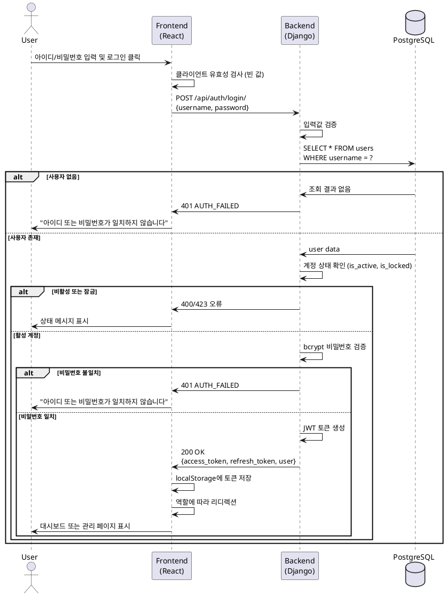

# Use Case 001: 사용자 로그인

## 기본 정보

| 항목 | 내용 |
|------|------|
| **Use Case ID** | UC-001 |
| **Use Case Name** | 사용자 로그인 |
| **Primary Actor** | 사용자 (관리자, 일반 사용자) |
| **Precondition** | 사용자 계정이 생성되어 있고 활성 상태임 |
| **Trigger** | 사용자가 로그인 페이지에서 아이디/비밀번호 입력 후 '로그인' 버튼 클릭 |

---

## Main Scenario

1. 사용자가 아이디(username)와 비밀번호(password)를 입력
2. 시스템이 입력값 유효성 검증 (빈 값 체크)
3. 시스템이 데이터베이스에서 username으로 사용자 조회
4. 사용자 계정 상태 확인 (is_active, is_locked)
5. 비밀번호 해시 값 비교 (bcrypt 검증)
6. JWT 토큰 생성 (Access Token, Refresh Token)
7. 클라이언트에 토큰 및 사용자 정보 반환
8. 클라이언트가 localStorage에 토큰 저장
9. 사용자 역할에 따라 페이지 리디렉션
   - admin: /admin/data-management
   - user: /dashboard

---

## Edge Cases

| 시나리오 | 처리 |
|---------|------|
| 아이디 또는 비밀번호 빈 값 | 400 오류, "필수 항목을 입력해주세요" |
| 존재하지 않는 아이디 | 401 오류, "아이디 또는 비밀번호가 일치하지 않습니다" |
| 비밀번호 불일치 | 401 오류, "아이디 또는 비밀번호가 일치하지 않습니다" |
| 계정 비활성 (is_active=false) | 400 오류, "비활성된 계정입니다" |
| 계정 잠금 (is_locked=true) | 423 오류, "계정이 잠겨있습니다" |
| DB 연결 오류 | 500 오류, "시스템 오류가 발생했습니다" |

---

## Business Rules

1. 비밀번호는 bcrypt로 암호화되어 저장
2. JWT Access Token 유효기간: 1시간
3. JWT Refresh Token 유효기간: 7일
4. 로그인 실패 시 보안을 위해 아이디 존재 여부를 노출하지 않음
5. 5회 이상 로그인 실패 시 계정 자동 잠금 (선택 사항)

---

## API Specification

### Endpoint: `POST /api/auth/login/`

**Request**
```json
{
  "username": "admin_user",
  "password": "SecurePassword123!"
}
```

**Response (200 OK)**
```json
{
  "access_token": "eyJ0eXAiOiJKV1Qi...",
  "refresh_token": "eyJ0eXAiOiJKV1Qi...",
  "user": {
    "id": 1,
    "username": "admin_user",
    "full_name": "Admin User",
    "role": "admin"
  }
}
```

**Error Responses**

| Status | Code | Message |
|--------|------|---------|
| 400 | INVALID_INPUT | 필수 항목을 입력해주세요 |
| 401 | AUTH_FAILED | 아이디 또는 비밀번호가 일치하지 않습니다 |
| 400 | ACCOUNT_INACTIVE | 비활성된 계정입니다 |
| 423 | ACCOUNT_LOCKED | 계정이 잠겨있습니다 |
| 500 | SERVER_ERROR | 시스템 오류가 발생했습니다 |

---

## Database Operations

**SELECT 쿼리**
```sql
SELECT id, username, password_hash, full_name, role, is_active, is_locked
FROM users
WHERE username = %s;
```

---

## Sequence Diagram



---

## Related Tables

- **users**: 사용자 정보 조회 및 인증
  - id, username, password_hash, full_name, role, is_active, is_locked
