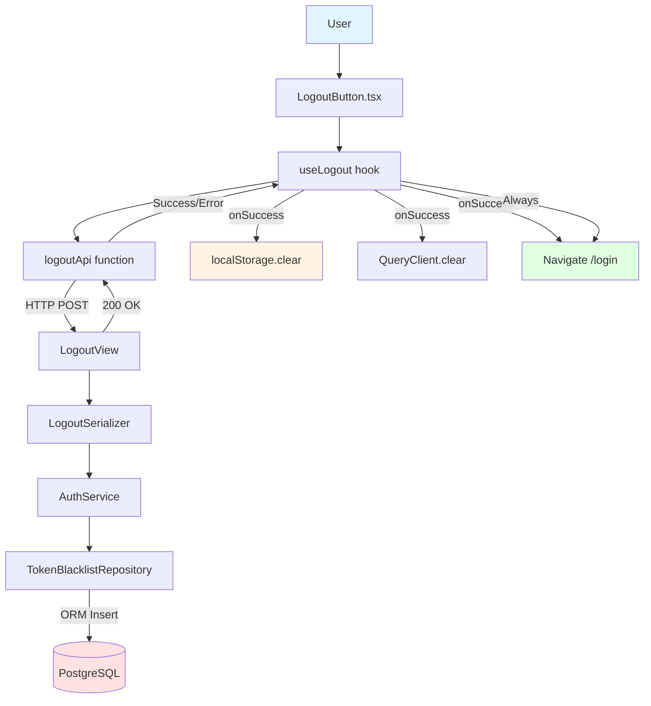

# UC-002: User Logout - Implementation Plan (TDD)

## 개요

**목표**: JWT Refresh Token 블랙리스트 기반 로그아웃, 클라이언트 토큰 삭제 및 리디렉션
**방법론**: TDD (Red → Green → Refactor)
**핵심 기술**: JWT Blacklist, localStorage 관리, TanStack Query 캐시 초기화

---

## 1. Module Overview

### 1.1 Backend Modules

| 모듈 | 경로 | 역할 | 의존성 |
|------|------|------|--------|
| **LogoutView** | `apps/authentication/views.py` | HTTP 요청/응답 처리 | LogoutSerializer, AuthService |
| **LogoutSerializer** | `apps/authentication/serializers.py` | Refresh Token 검증 | DRF Serializer |
| **AuthService** | `apps/authentication/services.py` | 토큰 블랙리스트 추가 로직 | TokenBlacklistRepository |
| **TokenBlacklistRepository** | `apps/authentication/repositories.py` | 블랙리스트 DB 저장 | Django ORM (TokenBlacklist model) |

### 1.2 Frontend Modules

| 모듈 | 경로 | 역할 | 의존성 |
|------|------|------|--------|
| **LogoutButton** | `components/common/LogoutButton.tsx` | 로그아웃 버튼 UI | useLogout hook |
| **useLogout** | `hooks/queries/useAuth.ts` | 로그아웃 mutation 관리 | TanStack Query, logoutApi |
| **logoutApi** | `api/endpoints/auth.api.ts` | API 통신 | axios client |

---

## 2. Dependency Diagram



---

## 3. TDD Implementation Order

### Phase 1: Backend - TokenBlacklistRepository (블랙리스트 저장)
### Phase 2: Backend - AuthService (토큰 무효화 로직)
### Phase 3: Backend - LogoutView (API Endpoint)
### Phase 4: Frontend - useLogout Hook (TanStack Query)
### Phase 5: Frontend - LogoutButton Component (UI)
### Phase 6: E2E Tests (Full Flow)

---

## 4. Phase 1: Backend - TokenBlacklistRepository

### 4.1 Test Scenarios (Unit Tests)

```python
# path: backend/apps/authentication/tests/test_repositories.py

import pytest
from datetime import datetime, timedelta

from ..repositories import TokenBlacklistRepository
from ..models import TokenBlacklist

@pytest.mark.django_db
class TestTokenBlacklistRepository:

    def test_add_token_to_blacklist_success(self):
        # Given
        repository = TokenBlacklistRepository()
        refresh_token = "fake_refresh_token_12345"
        expires_at = datetime.now() + timedelta(days=7)

        # When
        result = repository.add_to_blacklist(refresh_token, expires_at)

        # Then
        assert result is True
        assert TokenBlacklist.objects.filter(token=refresh_token).exists()

    def test_is_token_blacklisted(self):
        # Given
        repository = TokenBlacklistRepository()
        blacklisted_token = "blacklisted_token"
        TokenBlacklist.objects.create(
            token=blacklisted_token,
            blacklisted_at=datetime.now()
        )

        # When
        is_blacklisted = repository.is_blacklisted(blacklisted_token)

        # Then
        assert is_blacklisted is True

    def test_is_token_not_blacklisted(self):
        # Given
        repository = TokenBlacklistRepository()

        # When
        is_blacklisted = repository.is_blacklisted("valid_token")

        # Then
        assert is_blacklisted is False
```

### 4.2 Implementation (TokenBlacklistRepository)

```python
# path: backend/apps/authentication/repositories.py

from datetime import datetime
from typing import Optional

from .models import TokenBlacklist

class TokenBlacklistRepository:
    """
    토큰 블랙리스트 관리
    """

    def add_to_blacklist(self, token: str, expires_at: Optional[datetime] = None) -> bool:
        """
        Refresh Token을 블랙리스트에 추가

        Args:
            token: Refresh Token
            expires_at: 토큰 만료 시간 (선택)

        Returns:
            bool: 성공 여부
        """
        try:
            TokenBlacklist.objects.create(
                token=token,
                blacklisted_at=datetime.now(),
                expires_at=expires_at
            )
            return True
        except Exception:
            return False

    def is_blacklisted(self, token: str) -> bool:
        """
        토큰이 블랙리스트에 있는지 확인

        Args:
            token: 확인할 토큰

        Returns:
            bool: 블랙리스트 여부
        """
        return TokenBlacklist.objects.filter(token=token).exists()
```

### 4.3 Model Definition

```python
# path: backend/apps/authentication/models.py

from django.db import models

class TokenBlacklist(models.Model):
    """
    무효화된 Refresh Token 블랙리스트
    """
    token = models.CharField(max_length=500, unique=True, db_index=True)
    blacklisted_at = models.DateTimeField(auto_now_add=True)
    expires_at = models.DateTimeField(null=True, blank=True)

    class Meta:
        db_table = 'token_blacklist'
        indexes = [
            models.Index(fields=['token']),
            models.Index(fields=['blacklisted_at']),
        ]

    def __str__(self):
        return f"Blacklisted: {self.token[:20]}..."
```

---

## 5. Phase 2: Backend - AuthService

### 5.1 Test Scenarios (Unit Tests)

```python
# path: backend/apps/authentication/tests/test_services.py

import pytest
from unittest.mock import MagicMock
from datetime import datetime, timedelta

from ..services import AuthService
from ..exceptions import InvalidToken

@pytest.fixture
def mock_blacklist_repository():
    """Mock TokenBlacklistRepository fixture"""
    return MagicMock()

@pytest.fixture
def auth_service(mock_blacklist_repository):
    """AuthService with injected mock"""
    service = AuthService()
    service.blacklist_repository = mock_blacklist_repository
    return service

def test_logout_success(auth_service, mock_blacklist_repository):
    # Given
    refresh_token = "valid_refresh_token"
    mock_blacklist_repository.add_to_blacklist.return_value = True

    # When
    result = auth_service.logout(refresh_token)

    # Then
    assert result['status'] == 'success'
    assert result['message'] == '로그아웃되었습니다'
    mock_blacklist_repository.add_to_blacklist.assert_called_once_with(
        refresh_token,
        expires_at=None  # 실제로는 토큰에서 exp 추출
    )

def test_logout_with_already_blacklisted_token(auth_service, mock_blacklist_repository):
    # Given: 이미 블랙리스트에 있는 토큰
    refresh_token = "blacklisted_token"
    mock_blacklist_repository.is_blacklisted.return_value = True

    # When
    result = auth_service.logout(refresh_token)

    # Then: 성공 처리 (멱등성)
    assert result['status'] == 'success'

def test_logout_with_invalid_token(auth_service):
    # Given: 유효하지 않은 토큰
    invalid_token = ""

    # When & Then
    with pytest.raises(InvalidToken, match="유효하지 않은 토큰입니다"):
        auth_service.logout(invalid_token)
```

### 5.2 Implementation (AuthService - logout method)

```python
# path: backend/apps/authentication/services.py

from typing import Dict, Any
from datetime import datetime

from .repositories import TokenBlacklistRepository
from .jwt import JWTDecoder
from .exceptions import InvalidToken

class AuthService:
    """
    비즈니스 로직: 사용자 인증 및 JWT 관리
    """
    def __init__(self):
        self.blacklist_repository = TokenBlacklistRepository()
        self.jwt_decoder = JWTDecoder()

    def logout(self, refresh_token: str) -> Dict[str, Any]:
        """
        사용자 로그아웃 (Refresh Token 블랙리스트 추가)

        Args:
            refresh_token: Refresh Token

        Returns:
            {
                'status': 'success',
                'message': '로그아웃되었습니다'
            }

        Raises:
            InvalidToken: 유효하지 않은 토큰
        """
        # 1. 토큰 유효성 검사 (빈 값 체크)
        if not refresh_token or not isinstance(refresh_token, str):
            raise InvalidToken("유효하지 않은 토큰입니다")

        # 2. 이미 블랙리스트에 있는지 확인 (멱등성)
        if self.blacklist_repository.is_blacklisted(refresh_token):
            return {
                'status': 'success',
                'message': '로그아웃되었습니다'
            }

        # 3. 토큰에서 만료 시간 추출 (선택 사항)
        try:
            decoded = self.jwt_decoder.decode(refresh_token)
            expires_at = datetime.fromtimestamp(decoded['exp'])
        except Exception:
            expires_at = None  # 만료 시간 추출 실패 시 None

        # 4. 블랙리스트에 추가
        self.blacklist_repository.add_to_blacklist(refresh_token, expires_at)

        return {
            'status': 'success',
            'message': '로그아웃되었습니다'
        }
```

---

## 6. Phase 3: Backend - LogoutView (E2E)

### 6.1 Test Scenarios (E2E Tests)

```python
# path: backend/apps/authentication/tests/test_views.py

import pytest
from django.urls import reverse
from rest_framework import status

from apps.core.tests.factories import UserFactory

@pytest.mark.django_db
class TestLogoutAPI:
    """
    LogoutView E2E 테스트 (NO MOCKING)
    """

    def test_logout_success(self, api_client):
        # Given: 로그인된 사용자
        user = UserFactory(is_active=True)
        api_client.force_authenticate(user=user)

        # 실제 Refresh Token 생성 (간단히 문자열로 대체)
        refresh_token = "fake_refresh_token_12345"

        url = reverse('auth-logout')
        payload = {'refresh_token': refresh_token}

        # When: Mock 없이 실제 API 호출
        response = api_client.post(url, payload, format='json')

        # Then: 응답 검증
        assert response.status_code == status.HTTP_200_OK
        assert response.data['status'] == 'success'
        assert response.data['message'] == '로그아웃되었습니다'

        # DB 검증: 블랙리스트에 추가되었는지 확인
        from apps.authentication.models import TokenBlacklist
        assert TokenBlacklist.objects.filter(token=refresh_token).exists()

    def test_logout_without_token(self, api_client):
        # Given: 인증된 사용자, 빈 토큰
        user = UserFactory()
        api_client.force_authenticate(user=user)

        url = reverse('auth-logout')
        payload = {}

        # When
        response = api_client.post(url, payload, format='json')

        # Then
        assert response.status_code == status.HTTP_400_BAD_REQUEST

    def test_logout_unauthenticated(self, api_client):
        # Given: 인증되지 않은 사용자
        url = reverse('auth-logout')
        payload = {'refresh_token': 'some_token'}

        # When
        response = api_client.post(url, payload, format='json')

        # Then
        assert response.status_code == status.HTTP_401_UNAUTHORIZED
```

### 6.2 Implementation (LogoutView)

```python
# path: backend/apps/authentication/views.py

from rest_framework.views import APIView
from rest_framework.response import Response
from rest_framework import status
from rest_framework.permissions import IsAuthenticated

from .serializers import LogoutSerializer
from .services import AuthService

class LogoutView(APIView):
    """
    POST /api/auth/logout/

    사용자 로그아웃 API (Refresh Token 블랙리스트 추가)
    """
    permission_classes = [IsAuthenticated]

    def post(self, request):
        # 1. Request 검증
        serializer = LogoutSerializer(data=request.data)
        serializer.is_valid(raise_exception=True)

        # 2. Service Layer 호출
        service = AuthService()
        result = service.logout(
            refresh_token=serializer.validated_data['refresh_token']
        )

        # 3. Response 반환
        return Response(result, status=status.HTTP_200_OK)
```

### 6.3 Serializer

```python
# path: backend/apps/authentication/serializers.py

from rest_framework import serializers

class LogoutSerializer(serializers.Serializer):
    """
    로그아웃 요청 DTO
    """
    refresh_token = serializers.CharField(required=True)
```

---

## 7. Phase 4: Frontend - useLogout Hook

### 7.1 Test Scenarios (Unit Tests with MSW)

```typescript
// path: frontend/src/hooks/queries/useAuth.test.ts

import { renderHook, waitFor } from '@testing-library/react';
import { QueryClient, QueryClientProvider } from '@tanstack/react-query';
import { http, HttpResponse } from 'msw';
import { server } from '@/mocks/server';
import { useLogout } from './useAuth';

const createWrapper = () => {
  const queryClient = new QueryClient({
    defaultOptions: { queries: { retry: false }, mutations: { retry: false } }
  });
  return ({ children }: { children: React.ReactNode }) => (
    <QueryClientProvider client={queryClient}>{children}</QueryClientProvider>
  );
};

test('로그아웃 성공 시 localStorage 및 캐시 초기화', async () => {
  // Given: MSW로 성공 응답 설정
  server.use(
    http.post('/api/auth/logout/', () => {
      return HttpResponse.json({
        status: 'success',
        message: '로그아웃되었습니다'
      });
    })
  );

  // localStorage 설정
  localStorage.setItem('access_token', 'fake_access');
  localStorage.setItem('refresh_token', 'fake_refresh');

  // When: useLogout hook 실행
  const { result } = renderHook(() => useLogout(), { wrapper: createWrapper() });

  result.current.mutate({ refresh_token: 'fake_refresh' });

  // Then: 성공 응답 및 localStorage 삭제 확인
  await waitFor(() => expect(result.current.isSuccess).toBe(true));
  expect(localStorage.getItem('access_token')).toBeNull();
  expect(localStorage.getItem('refresh_token')).toBeNull();
});

test('로그아웃 실패 시에도 localStorage 삭제', async () => {
  // Given: MSW로 실패 응답
  server.use(
    http.post('/api/auth/logout/', () => {
      return HttpResponse.json(
        { message: '서버 오류' },
        { status: 500 }
      );
    })
  );

  localStorage.setItem('access_token', 'fake_access');
  localStorage.setItem('refresh_token', 'fake_refresh');

  // When
  const { result } = renderHook(() => useLogout(), { wrapper: createWrapper() });

  result.current.mutate({ refresh_token: 'fake_refresh' });

  // Then: 실패해도 localStorage는 삭제됨
  await waitFor(() => expect(result.current.isError).toBe(true));
  expect(localStorage.getItem('access_token')).toBeNull();
  expect(localStorage.getItem('refresh_token')).toBeNull();
});
```

### 7.2 Implementation (useLogout Hook)

```typescript
// path: frontend/src/hooks/queries/useAuth.ts

import { useMutation, useQueryClient } from '@tanstack/react-query';
import { useNavigate } from 'react-router-dom';
import { logoutApi } from '@/api/endpoints/auth.api';

export const useLogout = () => {
  const queryClient = useQueryClient();
  const navigate = useNavigate();

  return useMutation({
    mutationFn: logoutApi,
    onMutate: () => {
      // 즉시 localStorage 삭제 (네트워크 오류와 무관)
      localStorage.removeItem('access_token');
      localStorage.removeItem('refresh_token');
    },
    onSettled: () => {
      // 성공/실패 무관하게 실행
      // 1. React Query 캐시 초기화
      queryClient.clear();

      // 2. 로그인 페이지로 리디렉션
      navigate('/login', { replace: true });
    },
  });
};
```

### 7.3 API Function

```typescript
// path: frontend/src/api/endpoints/auth.api.ts

import apiClient from '@/api/client';

export const logoutApi = async (data: { refresh_token: string }): Promise<void> => {
  await apiClient.post('/api/auth/logout/', data);
};
```

---

## 8. Phase 5: Frontend - LogoutButton Component

### 8.1 Test Scenarios (Component Tests)

```typescript
// path: frontend/src/components/common/LogoutButton.test.tsx

import { render, screen, waitFor } from '@testing-library/react';
import userEvent from '@testing-library/user-event';
import { QueryClient, QueryClientProvider } from '@tanstack/react-query';
import { BrowserRouter } from 'react-router-dom';
import { http, HttpResponse } from 'msw';
import { server } from '@/mocks/server';
import { LogoutButton } from './LogoutButton';

const createWrapper = () => {
  const queryClient = new QueryClient();
  return ({ children }: { children: React.ReactNode }) => (
    <BrowserRouter>
      <QueryClientProvider client={queryClient}>{children}</QueryClientProvider>
    </BrowserRouter>
  );
};

test('로그아웃 버튼 클릭 시 API 호출 및 리디렉션', async () => {
  // Given: MSW로 성공 응답
  server.use(
    http.post('/api/auth/logout/', () => {
      return HttpResponse.json({ status: 'success', message: '로그아웃되었습니다' });
    })
  );

  localStorage.setItem('refresh_token', 'fake_refresh');

  render(<LogoutButton />, { wrapper: createWrapper() });

  const logoutBtn = screen.getByRole('button', { name: /로그아웃/i });

  // When: 로그아웃 버튼 클릭
  await userEvent.click(logoutBtn);

  // Then: localStorage 삭제 확인
  await waitFor(() => {
    expect(localStorage.getItem('refresh_token')).toBeNull();
  });
});
```

### 8.2 Implementation (LogoutButton)

```typescript
// path: frontend/src/components/common/LogoutButton.tsx

import { Button } from '@mui/material';
import { useLogout } from '@/hooks/queries/useAuth';

export const LogoutButton = () => {
  const { mutate, isPending } = useLogout();

  const handleLogout = () => {
    const refreshToken = localStorage.getItem('refresh_token');
    if (refreshToken) {
      mutate({ refresh_token: refreshToken });
    } else {
      // 토큰 없으면 바로 로그인 페이지로 이동
      window.location.href = '/login';
    }
  };

  return (
    <Button
      onClick={handleLogout}
      disabled={isPending}
      variant="outlined"
      color="inherit"
      data-testid="logout-button"
    >
      {isPending ? '로그아웃 중...' : '로그아웃'}
    </Button>
  );
};
```

---

## 9. Phase 6: E2E Tests (Playwright)

```typescript
// path: frontend/tests/logout.spec.ts

import { test, expect } from '@playwright/test';

test.describe('로그아웃 E2E', () => {
  test('로그아웃 버튼 클릭 시 로그인 페이지로 이동', async ({ page }) => {
    // Given: 로그인된 상태
    await page.goto('/dashboard');

    // 로그인 상태 설정 (localStorage)
    await page.evaluate(() => {
      localStorage.setItem('access_token', 'fake_access');
      localStorage.setItem('refresh_token', 'fake_refresh');
    });

    // When: 로그아웃 버튼 클릭
    await page.getByTestId('logout-button').click();

    // Then: 로그인 페이지로 리디렉션
    await expect(page).toHaveURL('/login');

    // localStorage 삭제 확인
    const accessToken = await page.evaluate(() => localStorage.getItem('access_token'));
    const refreshToken = await page.evaluate(() => localStorage.getItem('refresh_token'));
    expect(accessToken).toBeNull();
    expect(refreshToken).toBeNull();
  });
});
```

---

## 10. Implementation Checklist

### Backend
- [ ] TokenBlacklist 모델 정의 및 마이그레이션
- [ ] TokenBlacklistRepository 단위 테스트 작성 (3개 시나리오)
- [ ] TokenBlacklistRepository 구현
- [ ] AuthService.logout 단위 테스트 작성 (3개 시나리오)
- [ ] AuthService.logout 구현
- [ ] LogoutSerializer 작성
- [ ] LogoutView E2E 테스트 작성 (3개 시나리오)
- [ ] LogoutView 구현
- [ ] URL 라우팅 설정 (`/api/auth/logout/`)

### Frontend
- [ ] logoutApi 함수 작성
- [ ] useLogout hook 단위 테스트 작성 (2개 시나리오)
- [ ] useLogout hook 구현 (onMutate, onSettled)
- [ ] LogoutButton 컴포넌트 테스트 작성
- [ ] LogoutButton 컴포넌트 구현
- [ ] E2E 테스트 작성 (Playwright)

### Infrastructure
- [ ] MSW handlers 설정 (logout API)
- [ ] TokenBlacklist factory 작성 (factory-boy)

---

## 11. Test Coverage Goal

- **Backend Unit Tests**: 80%+ (TokenBlacklistRepository, AuthService)
- **Backend E2E Tests**: 100% (LogoutView API)
- **Frontend Unit Tests**: 80%+ (useLogout hook)
- **Frontend Component Tests**: 80%+ (LogoutButton)
- **Frontend E2E Tests**: 100% (로그아웃 플로우)

---

## 12. Notes

- **네트워크 오류 무관**: onMutate에서 즉시 localStorage 삭제
- **멱등성**: 이미 블랙리스트에 있는 토큰도 성공 처리
- **보안**: Refresh Token만 블랙리스트에 추가 (Access Token은 만료 대기)
- **선택 사항**: Redis를 사용한 블랙리스트 관리로 성능 개선 가능
- **정리 작업**: 주기적으로 만료된 블랙리스트 토큰 삭제 (Celery task)
