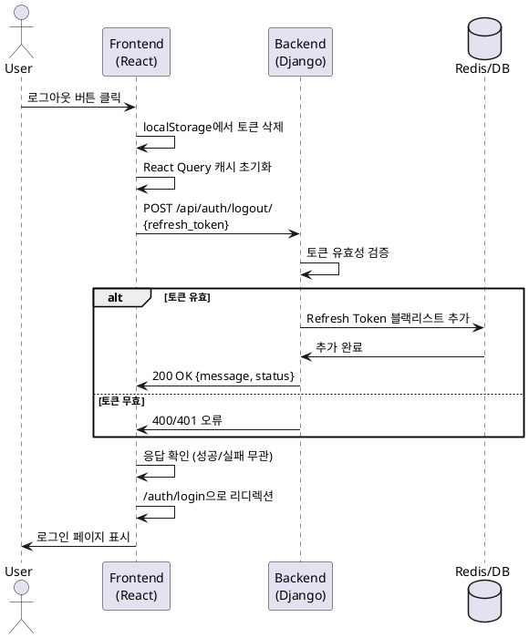

# Use Case 002: 사용자 로그아웃

## 기본 정보

| 항목 | 내용 |
|------|------|
| **Use Case ID** | UC-002 |
| **Use Case Name** | 사용자 로그아웃 |
| **Primary Actor** | 사용자 (관리자, 일반 사용자) |
| **Precondition** | 사용자가 로그인된 상태 (Access Token 보유) |
| **Trigger** | 사용자가 네비게이션 바의 '로그아웃' 버튼 클릭 |

---

## Main Scenario

1. 사용자가 '로그아웃' 버튼 클릭
2. 클라이언트가 localStorage에서 Access Token, Refresh Token 삭제
3. 클라이언트가 사용자 정보 캐시 초기화 (React Query 캐시)
4. 클라이언트가 백엔드에 로그아웃 API 호출 (Refresh Token 전송)
5. 백엔드가 Refresh Token을 블랙리스트에 추가 (Redis 또는 DB)
6. 백엔드가 로그아웃 성공 응답 반환
7. 클라이언트가 로그인 페이지(/auth/login)로 리디렉션

---

## Edge Cases

| 시나리오 | 처리 |
|---------|------|
| 토큰이 이미 만료됨 | 200 응답, 정상 처리 |
| 토큰이 유효하지 않음 | 400 오류, 클라이언트는 무시하고 로그인 페이지로 이동 |
| 네트워크 오류 | 클라이언트 토큰 삭제 후 로그인 페이지 이동 |
| 백엔드 서버 오류 | 클라이언트 토큰 삭제 후 로그인 페이지 이동 |

---

## Business Rules

1. 로그아웃은 네트워크 오류와 무관하게 클라이언트 토큰 삭제
2. Refresh Token은 블랙리스트에 등록하여 재사용 방지
3. 로그아웃 후 Protected Route 접근 시 자동 로그인 페이지 리디렉션
4. 여러 탭/창에서 로그인한 경우, 하나의 로그아웃으로 모두 무효화

---

## API Specification

### Endpoint: `POST /api/auth/logout/`

**Request**
```json
{
  "refresh_token": "eyJ0eXAiOiJKV1Qi..."
}
```

**Response (200 OK)**
```json
{
  "message": "로그아웃되었습니다",
  "status": "success"
}
```

**Error Responses**

| Status | Code | Message |
|--------|------|---------|
| 400 | INVALID_TOKEN | 유효하지 않은 토큰입니다 |
| 401 | UNAUTHORIZED | 인증이 필요합니다 |
| 500 | SERVER_ERROR | 시스템 오류가 발생했습니다 |

---

## Database Operations

**선택 사항: 감사 로그 기록**
```sql
INSERT INTO audit_logs (user_id, action, timestamp)
VALUES (%s, 'LOGOUT', CURRENT_TIMESTAMP);
```

---

## Sequence Diagram



---

## Related Tables

- **token_blacklist** (선택): 무효화된 토큰 관리
- **audit_logs** (선택): 로그아웃 감사 로그
