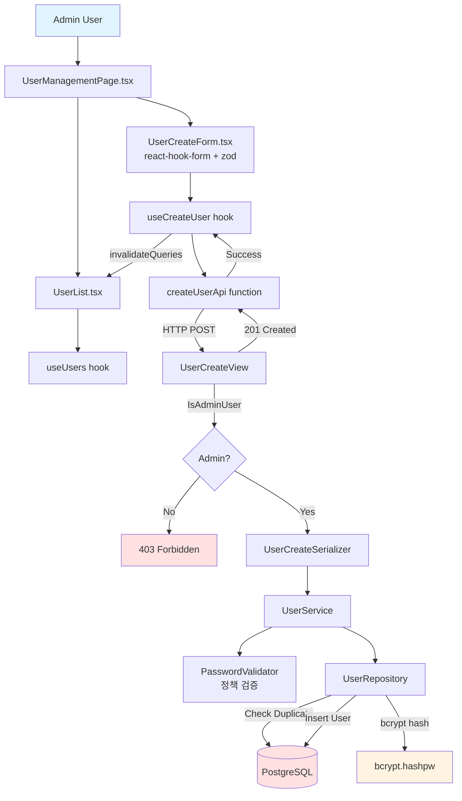

# UC-003: User Account Creation - Implementation Plan (TDD)

## 개요

**목표**: 관리자 전용 사용자 계정 생성, 비밀번호 정책 검증, bcrypt 해싱
**방법론**: TDD (Red → Green → Refactor)
**핵심 기술**: Django Permissions, bcrypt, react-hook-form + zod, TanStack Query

---

## 1. Module Overview

### 1.1 Backend Modules

| 모듈 | 경로 | 역할 | 의존성 |
|------|------|------|--------|
| **UserCreateView** | `apps/users/views.py` | HTTP 요청/응답 처리 | UserCreateSerializer, UserService |
| **UserCreateSerializer** | `apps/users/serializers.py` | 입력 검증 및 DTO | DRF Serializer |
| **UserService** | `apps/users/services.py` | 비즈니스 로직 (비밀번호 정책, 중복 확인) | UserRepository, PasswordValidator |
| **PasswordValidator** | `apps/users/validators.py` | 비밀번호 정책 검증 | None |
| **UserRepository** | `apps/users/repositories.py` | DB 액세스 (사용자 생성, 중복 확인) | Django ORM (User model) |
| **IsAdminUser** | `apps/core/permissions.py` | 관리자 권한 검증 | DRF Permission |

### 1.2 Frontend Modules

| 모듈 | 경로 | 역할 | 의존성 |
|------|------|------|--------|
| **UserManagementPage** | `components/pages/UserManagementPage.tsx` | 페이지 컨테이너 | UserList, UserCreateForm |
| **UserCreateForm** | `components/features/User/UserCreateForm.tsx` | 사용자 생성 폼 | useCreateUser hook, react-hook-form, zod |
| **UserList** | `components/features/User/UserList.tsx` | 사용자 목록 표시 | useUsers hook |
| **useCreateUser** | `hooks/queries/useUsers.ts` | 사용자 생성 mutation | TanStack Query, createUserApi |
| **createUserApi** | `api/endpoints/users.api.ts` | API 통신 | axios client |

---

## 2. Dependency Diagram



---

## 3. TDD Implementation Order

### Phase 1: Backend - PasswordValidator (비밀번호 정책)
### Phase 2: Backend - UserRepository (중복 확인, 생성)
### Phase 3: Backend - UserService (비즈니스 로직)
### Phase 4: Backend - UserCreateView (API Endpoint)
### Phase 5: Frontend - UserCreateForm (react-hook-form + zod)
### Phase 6: Frontend - useCreateUser Hook (TanStack Query)
### Phase 7: E2E Tests (Full Flow)

---

## 4. Phase 1: Backend - PasswordValidator

### 4.1 Test Scenarios (Unit Tests)

```python
# path: backend/apps/users/tests/test_validators.py

import pytest

from ..validators import PasswordValidator
from ..exceptions import PasswordPolicyError

def test_validate_password_success():
    # Given
    validator = PasswordValidator()
    valid_password = "SecurePass123!"

    # When & Then: 예외 발생하지 않음
    validator.validate(valid_password)

def test_validate_password_too_short():
    # Given
    validator = PasswordValidator()
    short_password = "Pass1!"

    # When & Then
    with pytest.raises(PasswordPolicyError, match="비밀번호는 최소 8자 이상이어야 합니다"):
        validator.validate(short_password)

def test_validate_password_missing_uppercase():
    # Given
    validator = PasswordValidator()
    no_uppercase = "password123!"

    # When & Then
    with pytest.raises(PasswordPolicyError, match="영문 대문자를 포함해야 합니다"):
        validator.validate(no_uppercase)

def test_validate_password_missing_digit():
    # Given
    validator = PasswordValidator()
    no_digit = "Password!"

    # When & Then
    with pytest.raises(PasswordPolicyError, match="숫자를 포함해야 합니다"):
        validator.validate(no_digit)

def test_validate_password_missing_special_char():
    # Given
    validator = PasswordValidator()
    no_special = "Password123"

    # When & Then
    with pytest.raises(PasswordPolicyError, match="특수문자를 포함해야 합니다"):
        validator.validate(no_special)
```

### 4.2 Implementation (PasswordValidator)

```python
# path: backend/apps/users/validators.py

import re
from .exceptions import PasswordPolicyError

class PasswordValidator:
    """
    비밀번호 정책 검증
    - 최소 8자
    - 영문 대소문자 + 숫자 + 특수문자 포함
    """

    MIN_LENGTH = 8
    SPECIAL_CHARS = r"[!@#$%^&*(),.?\":{}|<>]"

    def validate(self, password: str) -> None:
        """
        비밀번호 정책 검증

        Args:
            password: 검증할 비밀번호

        Raises:
            PasswordPolicyError: 정책 위반 시
        """
        # 1. 길이 검증
        if len(password) < self.MIN_LENGTH:
            raise PasswordPolicyError(f"비밀번호는 최소 {self.MIN_LENGTH}자 이상이어야 합니다")

        # 2. 영문 대문자 포함 검증
        if not re.search(r'[A-Z]', password):
            raise PasswordPolicyError("비밀번호는 영문 대문자를 포함해야 합니다")

        # 3. 영문 소문자 포함 검증
        if not re.search(r'[a-z]', password):
            raise PasswordPolicyError("비밀번호는 영문 소문자를 포함해야 합니다")

        # 4. 숫자 포함 검증
        if not re.search(r'\d', password):
            raise PasswordPolicyError("비밀번호는 숫자를 포함해야 합니다")

        # 5. 특수문자 포함 검증
        if not re.search(self.SPECIAL_CHARS, password):
            raise PasswordPolicyError("비밀번호는 특수문자를 포함해야 합니다")
```

---

## 5. Phase 2: Backend - UserRepository

### 5.1 Test Scenarios (Unit Tests)

```python
# path: backend/apps/users/tests/test_repositories.py

import pytest
from django.contrib.auth import get_user_model

from ..repositories import UserRepository

User = get_user_model()

@pytest.mark.django_db
class TestUserRepository:

    def test_is_username_taken_true(self):
        # Given: 기존 사용자
        User.objects.create_user(username='existing_user', password='pass')
        repository = UserRepository()

        # When
        is_taken = repository.is_username_taken('existing_user')

        # Then
        assert is_taken is True

    def test_is_username_taken_false(self):
        # Given
        repository = UserRepository()

        # When
        is_taken = repository.is_username_taken('new_user')

        # Then
        assert is_taken is False

    def test_create_user_success(self):
        # Given
        repository = UserRepository()
        user_data = {
            'username': 'test_user',
            'password_hash': 'hashed_password',
            'full_name': '테스트 사용자',
            'role': 'user'
        }

        # When
        user = repository.create_user(**user_data)

        # Then
        assert user.id is not None
        assert user.username == 'test_user'
        assert user.full_name == '테스트 사용자'
        assert user.is_active is True
        assert user.is_locked is False
```

### 5.2 Implementation (UserRepository)

```python
# path: backend/apps/users/repositories.py

from typing import Optional
from django.contrib.auth import get_user_model

User = get_user_model()

class UserRepository:
    """
    사용자 데이터 액세스
    """

    def is_username_taken(self, username: str) -> bool:
        """
        username 중복 여부 확인

        Args:
            username: 확인할 사용자명

        Returns:
            bool: 중복 여부
        """
        return User.objects.filter(username=username).exists()

    def create_user(
        self,
        username: str,
        password_hash: str,
        full_name: str,
        role: str = 'user'
    ) -> User:
        """
        사용자 생성

        Args:
            username: 사용자명
            password_hash: 해시된 비밀번호
            full_name: 전체 이름
            role: 역할 (admin | user)

        Returns:
            User: 생성된 사용자 객체
        """
        user = User.objects.create(
            username=username,
            password=password_hash,  # Django User 모델의 password 필드
            full_name=full_name,
            role=role,
            is_active=True,
            is_locked=False
        )
        return user

    def get_by_username(self, username: str) -> Optional[User]:
        """사용자 조회"""
        try:
            return User.objects.get(username=username)
        except User.DoesNotExist:
            return None
```

---

## 6. Phase 3: Backend - UserService

### 6.1 Test Scenarios (Unit Tests)

```python
# path: backend/apps/users/tests/test_services.py

import pytest
from unittest.mock import MagicMock, patch

from ..services import UserService
from ..exceptions import DuplicateUsername, PasswordPolicyError

@pytest.fixture
def mock_dependencies():
    with patch('apps.users.services.UserRepository') as MockRepo, \
         patch('apps.users.services.PasswordValidator') as MockValidator:

        # Repository mock
        MockRepo.return_value.is_username_taken.return_value = False
        MockRepo.return_value.create_user.return_value = MagicMock(
            id=1,
            username='new_user',
            full_name='신규 사용자',
            role='user',
            is_active=True
        )

        # Validator mock
        MockValidator.return_value.validate.return_value = None  # 성공

        yield {
            'repository': MockRepo.return_value,
            'validator': MockValidator.return_value
        }

def test_create_user_success(mock_dependencies):
    # Given
    service = UserService()
    service.repository = mock_dependencies['repository']
    service.password_validator = mock_dependencies['validator']

    # When
    user = service.create_user(
        username='new_user',
        password='SecurePass123!',
        full_name='신규 사용자',
        role='user'
    )

    # Then
    assert user['username'] == 'new_user'
    assert user['full_name'] == '신규 사용자'
    mock_dependencies['validator'].validate.assert_called_once_with('SecurePass123!')
    mock_dependencies['repository'].is_username_taken.assert_called_once_with('new_user')
    mock_dependencies['repository'].create_user.assert_called_once()

def test_create_user_duplicate_username(mock_dependencies):
    # Given: username 중복
    mock_dependencies['repository'].is_username_taken.return_value = True

    service = UserService()
    service.repository = mock_dependencies['repository']

    # When & Then
    with pytest.raises(DuplicateUsername, match="이미 사용 중인 아이디입니다"):
        service.create_user(
            username='existing_user',
            password='SecurePass123!',
            full_name='사용자',
            role='user'
        )

def test_create_user_weak_password(mock_dependencies):
    # Given: 약한 비밀번호
    mock_dependencies['validator'].validate.side_effect = PasswordPolicyError("비밀번호는 최소 8자 이상이어야 합니다")

    service = UserService()
    service.password_validator = mock_dependencies['validator']

    # When & Then
    with pytest.raises(PasswordPolicyError):
        service.create_user(
            username='user',
            password='weak',
            full_name='사용자',
            role='user'
        )
```

### 6.2 Implementation (UserService)

```python
# path: backend/apps/users/services.py

from typing import Dict, Any
from django.contrib.auth.hashers import make_password

from .repositories import UserRepository
from .validators import PasswordValidator
from .exceptions import DuplicateUsername

class UserService:
    """
    사용자 관리 비즈니스 로직
    """
    def __init__(self):
        self.repository = UserRepository()
        self.password_validator = PasswordValidator()

    def create_user(
        self,
        username: str,
        password: str,
        full_name: str,
        role: str = 'user'
    ) -> Dict[str, Any]:
        """
        사용자 생성

        Args:
            username: 사용자명
            password: 평문 비밀번호
            full_name: 전체 이름
            role: 역할 (admin | user)

        Returns:
            {
                'id': int,
                'username': str,
                'full_name': str,
                'role': str,
                'is_active': bool,
                'created_at': str
            }

        Raises:
            PasswordPolicyError: 비밀번호 정책 위반
            DuplicateUsername: username 중복
        """
        # 1. 비밀번호 정책 검증
        self.password_validator.validate(password)

        # 2. username 중복 확인
        if self.repository.is_username_taken(username):
            raise DuplicateUsername("이미 사용 중인 아이디입니다")

        # 3. 비밀번호 해싱 (bcrypt)
        password_hash = make_password(password)

        # 4. 사용자 생성
        user = self.repository.create_user(
            username=username,
            password_hash=password_hash,
            full_name=full_name,
            role=role
        )

        # 5. 응답 데이터 구성
        return {
            'id': user.id,
            'username': user.username,
            'full_name': user.full_name,
            'role': user.role,
            'is_active': user.is_active,
            'created_at': user.created_at.isoformat() if hasattr(user, 'created_at') else None
        }
```

---

## 7. Phase 4: Backend - UserCreateView (E2E)

### 7.1 Test Scenarios (E2E Tests)

```python
# path: backend/apps/users/tests/test_views.py

import pytest
from django.urls import reverse
from rest_framework import status

from apps.core.tests.factories import UserFactory

@pytest.mark.django_db
class TestUserCreateAPI:
    """
    UserCreateView E2E 테스트 (NO MOCKING)
    """

    def test_create_user_success_as_admin(self, api_client):
        # Given: admin 사용자
        admin_user = UserFactory(role='admin', is_active=True)
        api_client.force_authenticate(user=admin_user)

        url = reverse('user-create')
        payload = {
            'username': 'new_user',
            'password': 'SecurePass123!',
            'full_name': '신규 사용자',
            'role': 'user'
        }

        # When: Mock 없이 실제 API 호출
        response = api_client.post(url, payload, format='json')

        # Then: 응답 검증
        assert response.status_code == status.HTTP_201_CREATED
        assert response.data['username'] == 'new_user'
        assert response.data['full_name'] == '신규 사용자'
        assert response.data['role'] == 'user'

        # DB 검증
        from django.contrib.auth import get_user_model
        User = get_user_model()
        assert User.objects.filter(username='new_user').exists()

    def test_create_user_forbidden_as_non_admin(self, api_client):
        # Given: 일반 사용자
        normal_user = UserFactory(role='user')
        api_client.force_authenticate(user=normal_user)

        url = reverse('user-create')
        payload = {
            'username': 'new_user',
            'password': 'SecurePass123!',
            'full_name': '사용자',
            'role': 'user'
        }

        # When
        response = api_client.post(url, payload, format='json')

        # Then
        assert response.status_code == status.HTTP_403_FORBIDDEN

    def test_create_user_duplicate_username(self, api_client):
        # Given: 기존 사용자
        admin_user = UserFactory(role='admin')
        api_client.force_authenticate(user=admin_user)

        UserFactory(username='existing_user')

        url = reverse('user-create')
        payload = {
            'username': 'existing_user',
            'password': 'SecurePass123!',
            'full_name': '중복 사용자',
            'role': 'user'
        }

        # When
        response = api_client.post(url, payload, format='json')

        # Then
        assert response.status_code == status.HTTP_409_CONFLICT

    def test_create_user_weak_password(self, api_client):
        # Given
        admin_user = UserFactory(role='admin')
        api_client.force_authenticate(user=admin_user)

        url = reverse('user-create')
        payload = {
            'username': 'user',
            'password': 'weak',  # 정책 위반
            'full_name': '사용자',
            'role': 'user'
        }

        # When
        response = api_client.post(url, payload, format='json')

        # Then
        assert response.status_code == status.HTTP_400_BAD_REQUEST
```

### 7.2 Implementation (UserCreateView)

```python
# path: backend/apps/users/views.py

from rest_framework.views import APIView
from rest_framework.response import Response
from rest_framework import status
from rest_framework.permissions import IsAuthenticated

from apps.core.permissions import IsAdminUser
from .serializers import UserCreateSerializer
from .services import UserService

class UserCreateView(APIView):
    """
    POST /api/users/

    관리자 전용 사용자 생성 API
    """
    permission_classes = [IsAuthenticated, IsAdminUser]

    def post(self, request):
        # 1. Request 검증
        serializer = UserCreateSerializer(data=request.data)
        serializer.is_valid(raise_exception=True)

        # 2. Service Layer 호출
        service = UserService()
        user = service.create_user(
            username=serializer.validated_data['username'],
            password=serializer.validated_data['password'],
            full_name=serializer.validated_data['full_name'],
            role=serializer.validated_data.get('role', 'user')
        )

        # 3. Response 반환
        return Response(user, status=status.HTTP_201_CREATED)
```

### 7.3 Serializer

```python
# path: backend/apps/users/serializers.py

from rest_framework import serializers

class UserCreateSerializer(serializers.Serializer):
    """
    사용자 생성 요청 DTO
    """
    username = serializers.CharField(required=True, min_length=3, max_length=100)
    password = serializers.CharField(required=True, write_only=True)
    full_name = serializers.CharField(required=True, max_length=200)
    role = serializers.ChoiceField(choices=['admin', 'user'], default='user')

    def validate_username(self, value):
        """username 형식 검증 (영문, 숫자, 언더스코어)"""
        import re
        if not re.match(r'^[a-zA-Z0-9_]+$', value):
            raise serializers.ValidationError("아이디는 영문, 숫자, 언더스코어만 사용 가능합니다")
        return value
```

### 7.4 Permission Class

```python
# path: backend/apps/core/permissions.py

from rest_framework.permissions import BasePermission

class IsAdminUser(BasePermission):
    """
    관리자 권한 확인
    """
    def has_permission(self, request, view):
        return request.user and request.user.is_authenticated and request.user.role == 'admin'
```

---

## 8. Phase 5: Frontend - UserCreateForm

### 8.1 Test Scenarios (Component Tests)

```typescript
// path: frontend/src/components/features/User/UserCreateForm.test.tsx

import { render, screen, waitFor } from '@testing-library/react';
import userEvent from '@testing-library/user-event';
import { QueryClient, QueryClientProvider } from '@tanstack/react-query';
import { http, HttpResponse } from 'msw';
import { server } from '@/mocks/server';
import { UserCreateForm } from './UserCreateForm';

const createWrapper = () => {
  const queryClient = new QueryClient();
  return ({ children }: { children: React.ReactNode }) => (
    <QueryClientProvider client={queryClient}>{children}</QueryClientProvider>
  );
};

test('유효한 입력으로 사용자 생성 성공', async () => {
  // Given: MSW로 성공 응답
  server.use(
    http.post('/api/users/', () => {
      return HttpResponse.json({
        id: 1,
        username: 'new_user',
        full_name: '신규 사용자',
        role: 'user',
        is_active: true
      }, { status: 201 });
    })
  );

  render(<UserCreateForm />, { wrapper: createWrapper() });

  // When: 폼 입력
  await userEvent.type(screen.getByLabelText(/아이디/i), 'new_user');
  await userEvent.type(screen.getByLabelText(/비밀번호/i), 'SecurePass123!');
  await userEvent.type(screen.getByLabelText(/이름/i), '신규 사용자');
  await userEvent.click(screen.getByRole('button', { name: /생성/i }));

  // Then: 성공 메시지 표시
  expect(await screen.findByText(/사용자가 생성되었습니다/i)).toBeInTheDocument();
});

test('약한 비밀번호 입력 시 클라이언트 검증 오류', async () => {
  render(<UserCreateForm />, { wrapper: createWrapper() });

  // When: 약한 비밀번호 입력
  await userEvent.type(screen.getByLabelText(/아이디/i), 'user');
  await userEvent.type(screen.getByLabelText(/비밀번호/i), 'weak');
  await userEvent.type(screen.getByLabelText(/이름/i), '사용자');
  await userEvent.click(screen.getByRole('button', { name: /생성/i }));

  // Then: zod 검증 오류 표시
  expect(await screen.findByText(/최소 8자/i)).toBeInTheDocument();
});
```

### 8.2 Implementation (UserCreateForm)

```typescript
// path: frontend/src/components/features/User/UserCreateForm.tsx

import { useForm } from 'react-hook-form';
import { zodResolver } from '@hookform/resolvers/zod';
import { z } from 'zod';
import { Box, TextField, Button, Select, MenuItem, FormControl, InputLabel, Alert } from '@mui/material';
import { useCreateUser } from '@/hooks/queries/useUsers';

const userCreateSchema = z.object({
  username: z.string()
    .min(3, '아이디는 최소 3자 이상이어야 합니다')
    .max(100)
    .regex(/^[a-zA-Z0-9_]+$/, '아이디는 영문, 숫자, 언더스코어만 사용 가능합니다'),
  password: z.string()
    .min(8, '비밀번호는 최소 8자 이상이어야 합니다')
    .regex(/[A-Z]/, '영문 대문자를 포함해야 합니다')
    .regex(/[a-z]/, '영문 소문자를 포함해야 합니다')
    .regex(/\d/, '숫자를 포함해야 합니다')
    .regex(/[!@#$%^&*(),.?":{}|<>]/, '특수문자를 포함해야 합니다'),
  full_name: z.string().min(1, '이름을 입력해주세요'),
  role: z.enum(['admin', 'user']),
});

type UserCreateFormData = z.infer<typeof userCreateSchema>;

export const UserCreateForm = () => {
  const { mutate, isPending, isSuccess, isError, error } = useCreateUser();

  const {
    register,
    handleSubmit,
    reset,
    formState: { errors },
  } = useForm<UserCreateFormData>({
    resolver: zodResolver(userCreateSchema),
    defaultValues: { role: 'user' }
  });

  const onSubmit = (data: UserCreateFormData) => {
    mutate(data, {
      onSuccess: () => {
        reset();
      }
    });
  };

  return (
    <Box component="form" onSubmit={handleSubmit(onSubmit)} sx={{ mt: 2 }}>
      <TextField
        {...register('username')}
        label="아이디"
        fullWidth
        margin="normal"
        error={!!errors.username}
        helperText={errors.username?.message}
        data-testid="username-input"
      />
      <TextField
        {...register('password')}
        label="비밀번호"
        type="password"
        fullWidth
        margin="normal"
        error={!!errors.password}
        helperText={errors.password?.message}
        data-testid="password-input"
      />
      <TextField
        {...register('full_name')}
        label="이름"
        fullWidth
        margin="normal"
        error={!!errors.full_name}
        helperText={errors.full_name?.message}
        data-testid="fullname-input"
      />
      <FormControl fullWidth margin="normal">
        <InputLabel>역할</InputLabel>
        <Select {...register('role')} defaultValue="user">
          <MenuItem value="user">일반 사용자</MenuItem>
          <MenuItem value="admin">관리자</MenuItem>
        </Select>
      </FormControl>

      {isSuccess && (
        <Alert severity="success" sx={{ mt: 2 }}>사용자가 생성되었습니다</Alert>
      )}
      {isError && (
        <Alert severity="error" sx={{ mt: 2 }}>
          {error?.message || '사용자 생성 중 오류가 발생했습니다'}
        </Alert>
      )}

      <Button
        type="submit"
        fullWidth
        variant="contained"
        sx={{ mt: 3 }}
        disabled={isPending}
        data-testid="submit-button"
      >
        {isPending ? '생성 중...' : '사용자 생성'}
      </Button>
    </Box>
  );
};
```

---

## 9. Phase 6: Frontend - useCreateUser Hook

### 9.1 Implementation (useCreateUser)

```typescript
// path: frontend/src/hooks/queries/useUsers.ts

import { useMutation, useQueryClient } from '@tanstack/react-query';
import { createUserApi } from '@/api/endpoints/users.api';
import type { CreateUserRequest, CreateUserResponse } from '@/types/dto/users.dto';

export const useCreateUser = () => {
  const queryClient = useQueryClient();

  return useMutation<CreateUserResponse, Error, CreateUserRequest>({
    mutationFn: createUserApi,
    onSuccess: () => {
      // 사용자 목록 새로 고침
      queryClient.invalidateQueries({ queryKey: ['users'] });
    },
  });
};
```

### 9.2 API Function

```typescript
// path: frontend/src/api/endpoints/users.api.ts

import apiClient from '@/api/client';
import type { CreateUserRequest, CreateUserResponse } from '@/types/dto/users.dto';

export const createUserApi = async (data: CreateUserRequest): Promise<CreateUserResponse> => {
  const response = await apiClient.post<CreateUserResponse>('/api/users/', data);
  return response.data;
};
```

### 9.3 TypeScript Types

```typescript
// path: frontend/src/types/dto/users.dto.ts

export interface CreateUserRequest {
  username: string;
  password: string;
  full_name: string;
  role: 'admin' | 'user';
}

export interface CreateUserResponse {
  id: number;
  username: string;
  full_name: string;
  role: 'admin' | 'user';
  is_active: boolean;
  created_at: string;
}
```

---

## 10. Implementation Checklist

### Backend
- [ ] PasswordValidator 단위 테스트 작성 (5개 시나리오)
- [ ] PasswordValidator 구현
- [ ] UserRepository 단위 테스트 작성 (3개 시나리오)
- [ ] UserRepository 구현
- [ ] UserService 단위 테스트 작성 (3개 시나리오)
- [ ] UserService 구현
- [ ] UserCreateSerializer 작성 (username 형식 검증)
- [ ] IsAdminUser 권한 클래스 작성
- [ ] UserCreateView E2E 테스트 작성 (4개 시나리오)
- [ ] UserCreateView 구현
- [ ] URL 라우팅 설정 (`/api/users/`)
- [ ] Custom Exceptions 정의 (PasswordPolicyError, DuplicateUsername)

### Frontend
- [ ] userCreateSchema (zod) 작성 (비밀번호 정책 검증)
- [ ] UserCreateForm 컴포넌트 테스트 작성 (2개 시나리오)
- [ ] UserCreateForm 구현 (react-hook-form + zod)
- [ ] useCreateUser hook 구현
- [ ] createUserApi 함수 작성
- [ ] DTO 타입 정의 (CreateUserRequest, CreateUserResponse)
- [ ] E2E 테스트 작성 (Playwright)

### Infrastructure
- [ ] MSW handlers 설정 (user create API)
- [ ] User factory 작성 (factory-boy)

---

## 11. Test Coverage Goal

- **Backend Unit Tests**: 80%+ (PasswordValidator, UserRepository, UserService)
- **Backend E2E Tests**: 100% (UserCreateView API)
- **Frontend Unit Tests**: 80%+ (useCreateUser hook)
- **Frontend Component Tests**: 80%+ (UserCreateForm)
- **Frontend E2E Tests**: 100% (사용자 생성 플로우)

---

## 12. Notes

- **비밀번호 해싱**: Django의 `make_password()` 사용 (기본 bcrypt)
- **권한 검증**: IsAdminUser permission으로 관리자만 접근
- **클라이언트 검증**: zod로 서버 요청 전 검증 (UX 개선)
- **서버 검증**: PasswordValidator로 정책 재검증 (보안)
- **에러 핸들링**: 409 Conflict (중복), 400 Bad Request (정책 위반)
