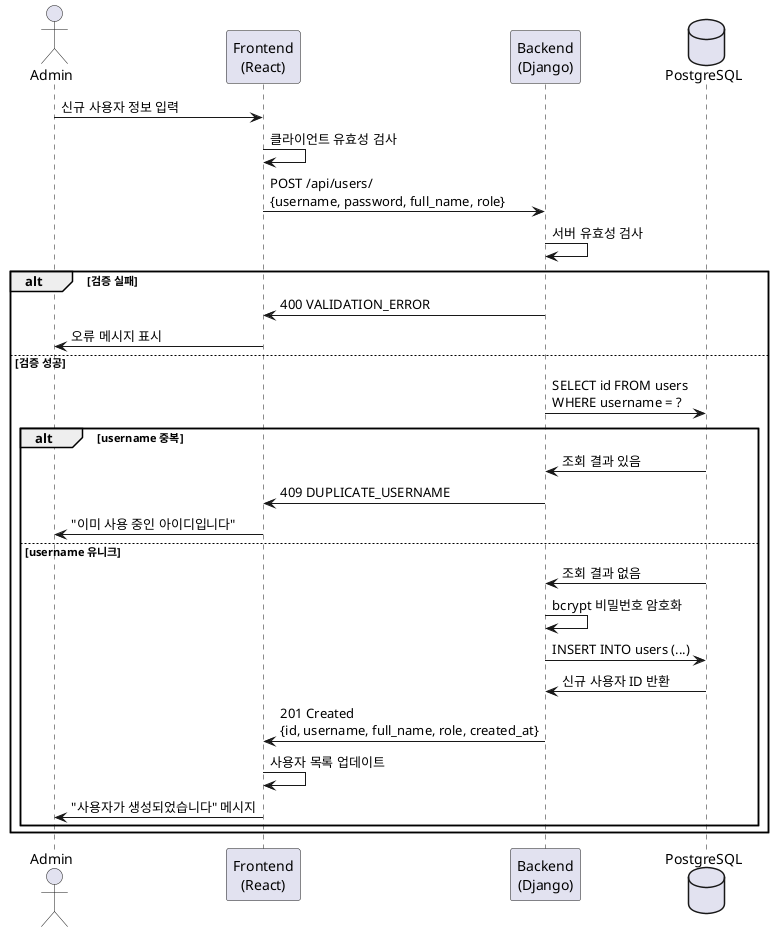

# Use Case 003: 사용자 계정 생성

## 기본 정보

| 항목 | 내용 |
|------|------|
| **Use Case ID** | UC-003 |
| **Use Case Name** | 사용자 계정 생성 |
| **Primary Actor** | 관리자 |
| **Precondition** | 관리자가 로그인된 상태 (role = 'admin') |
| **Trigger** | 관리자가 '사용자 관리' 페이지에서 '신규 사용자 추가' 버튼 클릭 |

---

## Main Scenario

1. 관리자가 신규 사용자 정보 입력 폼 작성
   - 필수: username, password, full_name, role
2. 시스템이 입력값 유효성 검사
   - username: 3-100자, 영문/숫자/언더스코어
   - password: 최소 8자, 영문+숫자+특수문자
   - role: 'admin' 또는 'user'
3. 시스템이 username 중복 여부 확인
4. 시스템이 비밀번호를 bcrypt로 암호화
5. 시스템이 users 테이블에 신규 사용자 정보 INSERT
6. 시스템이 생성된 사용자 정보 반환
7. UI가 사용자 목록을 새로 고침하여 신규 사용자 표시

---

## Edge Cases

| 시나리오 | 처리 |
|---------|------|
| 필수 항목 누락 | 400 오류, "필수 항목을 입력해주세요" |
| username 3자 미만 | 400 오류, "아이디는 3-100자여야 합니다" |
| username에 허용되지 않은 문자 | 400 오류, "아이디는 영문, 숫자, 언더스코어만 사용 가능합니다" |
| password 8자 미만 | 400 오류, "비밀번호는 최소 8자 이상이어야 합니다" |
| password 정책 불만족 | 400 오류, "비밀번호는 영문, 숫자, 특수문자를 포함해야 합니다" |
| username 중복 | 409 오류, "이미 사용 중인 아이디입니다" |
| 관리자 권한 없음 | 403 오류, "관리자만 이 기능을 사용할 수 있습니다" |
| DB 오류 | 500 오류, "사용자 생성 중 오류가 발생했습니다" |

---

## Business Rules

1. 관리자(role='admin')만 사용자 생성 가능
2. username은 데이터베이스에서 UNIQUE 제약
3. 비밀번호 정책:
   - 최소 8자
   - 영문 대소문자 + 숫자 + 특수문자 포함
   - bcrypt 해시로 저장
4. 신규 사용자는 활성(is_active=true), 미잠금(is_locked=false) 상태로 생성

---

## API Specification

### Endpoint: `POST /api/users/` (관리자 전용)

**Request**
```json
{
  "username": "new_user",
  "password": "SecurePass123!",
  "full_name": "홍길동",
  "role": "user"
}
```

**Response (201 Created)**
```json
{
  "id": 42,
  "username": "new_user",
  "full_name": "홍길동",
  "role": "user",
  "is_active": true,
  "created_at": "2025-01-15T10:30:00Z"
}
```

**Error Responses**

| Status | Code | Message |
|--------|------|---------|
| 400 | VALIDATION_ERROR | 필수 항목을 입력해주세요 |
| 409 | DUPLICATE_USERNAME | 이미 사용 중인 아이디입니다 |
| 403 | FORBIDDEN | 관리자만 이 기능을 사용할 수 있습니다 |
| 500 | SERVER_ERROR | 사용자 생성 중 오류가 발생했습니다 |

---

## Database Operations

**INSERT 쿼리**
```sql
INSERT INTO users (username, password_hash, full_name, role, is_active, is_locked, created_at, updated_at)
VALUES (%s, %s, %s, %s, true, false, CURRENT_TIMESTAMP, CURRENT_TIMESTAMP)
RETURNING id, username, full_name, role, is_active, created_at;
```

**중복 확인 쿼리**
```sql
SELECT id FROM users WHERE username = %s LIMIT 1;
```

---

## Sequence Diagram



---

## Related Tables

- **users**: 사용자 정보 저장
  - id, username (UNIQUE), password_hash, full_name, role, is_active, is_locked
