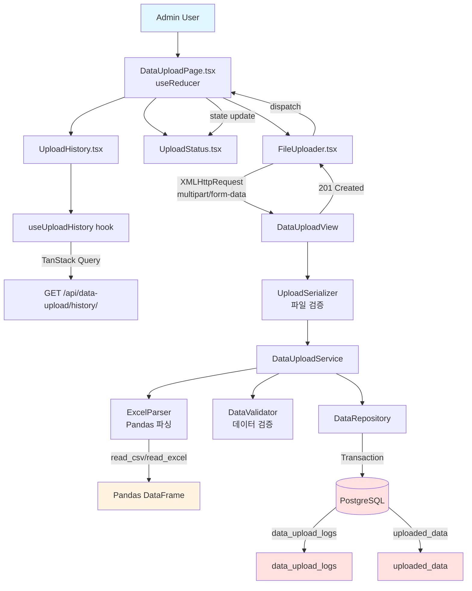

# UC-004: Data Upload - Implementation Plan (TDD)

## 개요

**목표**: Django + Pandas로 엑셀 파일 파싱 및 데이터 저장, React로 파일 업로드 UI 구현
**방법론**: TDD (Red → Green → Refactor)
**핵심 기술**: Pandas, Django File Upload, XMLHttpRequest, TanStack Query, useReducer

---

## 1. Module Overview

### 1.1 Backend Modules

| 모듈 | 경로 | 역할 | 의존성 |
|------|------|------|--------|
| **DataUploadView** | `apps/data_upload/views.py` | HTTP multipart 요청/응답 처리 | UploadSerializer, DataUploadService |
| **UploadSerializer** | `apps/data_upload/serializers.py` | 파일 검증 (형식, 크기) | DRF Serializer |
| **DataUploadService** | `apps/data_upload/services.py` | 비즈니스 로직 (파싱, 검증, 저장) | ExcelParser, DataValidator, DataRepository |
| **ExcelParser** | `apps/data_upload/parsers.py` | 엑셀 파싱 및 데이터 타입 감지 | Pandas |
| **DataValidator** | `apps/data_upload/validators.py` | 데이터 검증 (필수 컬럼, 타입, 범위) | None |
| **DataRepository** | `apps/data_upload/repositories.py` | DB 트랜잭션 관리 및 저장 | Django ORM (UploadedData, DataUploadLog) |

### 1.2 Frontend Modules

| 모듈 | 경로 | 역할 | 의존성 |
|------|------|------|--------|
| **DataUploadPage** | `components/pages/DataUploadPage.tsx` | 페이지 컨테이너 (useReducer 상태 관리) | FileUploader, UploadStatus, UploadHistory |
| **FileUploader** | `components/features/Upload/FileUploader.tsx` | 파일 선택 및 업로드 UI | uploadReducer (props) |
| **UploadStatus** | `components/features/Upload/UploadStatus.tsx` | 업로드 상태 표시 (진행률, 결과) | uploadReducer (props) |
| **UploadHistory** | `components/features/Upload/UploadHistory.tsx` | 업로드 이력 표시 | useUploadHistory hook |
| **useUploadHistory** | `hooks/queries/useUploadHistory.ts` | 업로드 이력 조회 | TanStack Query |

---

## 2. Dependency Diagram



---

## 3. TDD Implementation Order

### Phase 1: Backend - ExcelParser (Pandas 파싱)
### Phase 2: Backend - DataValidator (데이터 검증)
### Phase 3: Backend - DataUploadService (트랜잭션 관리)
### Phase 4: Backend - DataUploadView (API Endpoint)
### Phase 5: Frontend - useReducer (상태 관리)
### Phase 6: Frontend - FileUploader Component (파일 업로드 UI)
### Phase 7: E2E Tests (Full Flow)

---

## 4. Phase 1: Backend - ExcelParser

### 4.1 Test Scenarios (Unit Tests)

#### Test 1: KPI 데이터 파싱 성공
```python
# path: backend/apps/data_upload/tests/test_parsers.py

import pytest
import pandas as pd
from io import BytesIO

from ..parsers import ExcelParser
from ..exceptions import ParseError

@pytest.fixture
def kpi_csv_file():
    """KPI CSV 파일 fixture"""
    csv_content = """평가년도,학기,단과대학,학과,정원내입학생,취업률,전임교원
2025,1,공과대학,컴퓨터공학과,120,88.5,17
2025,1,인문대학,철학과,40,65.0,6"""
    return BytesIO(csv_content.encode('utf-8'))

def test_parse_kpi_csv_success(kpi_csv_file):
    # Given
    parser = ExcelParser()

    # When
    result = parser.parse(kpi_csv_file, filename='department_kpi.csv')

    # Then
    assert result['data_type'] == 'kpi'
    assert len(result['records']) == 2
    assert result['records'][0]['평가년도'] == 2025
    assert result['records'][0]['학과'] == '컴퓨터공학과'
    assert result['records'][0]['취업률'] == 88.5
```

#### Test 2: Publication 데이터 파싱 성공
```python
@pytest.fixture
def publication_csv_file():
    csv_content = """논문ID,게재일,단과대학,학과,논문제목,주저자,학술지명,학술지등급
PUB-25-001,2025-06-15,공과대학,컴퓨터공학과,Federated Learning,이서연,IEEE Transactions,SCIE"""
    return BytesIO(csv_content.encode('utf-8'))

def test_parse_publication_csv_success(publication_csv_file):
    # Given
    parser = ExcelParser()

    # When
    result = parser.parse(publication_csv_file, filename='publication_list.csv')

    # Then
    assert result['data_type'] == 'publication'
    assert len(result['records']) == 1
    assert result['records'][0]['논문ID'] == 'PUB-25-001'
    assert result['records'][0]['주저자'] == '이서연'
```

#### Test 3: 필수 컬럼 누락 시 ParseError 발생
```python
def test_parse_missing_required_columns():
    # Given: '평가년도' 컬럼 누락
    csv_content = """학기,단과대학,학과
1,공과대학,컴퓨터공학과"""
    csv_file = BytesIO(csv_content.encode('utf-8'))
    parser = ExcelParser()

    # When & Then
    with pytest.raises(ParseError, match="필수 컬럼이 누락되었습니다"):
        parser.parse(csv_file, filename='test.csv')
```

#### Test 4: 손상된 파일 파싱 실패
```python
def test_parse_corrupted_file():
    # Given: 손상된 파일
    corrupted_file = BytesIO(b"invalid csv content{][];")
    parser = ExcelParser()

    # When & Then
    with pytest.raises(ParseError, match="파일이 손상되었거나 올바른 형식이 아닙니다"):
        parser.parse(corrupted_file, filename='test.csv')
```

### 4.2 Implementation (ExcelParser)

```python
# path: backend/apps/data_upload/parsers.py

import pandas as pd
from typing import Dict, List, Any
from io import BytesIO

from .exceptions import ParseError

class ExcelParser:
    """
    Pandas를 사용한 엑셀 파일 파싱 및 데이터 타입 자동 감지
    """

    # 데이터 타입별 필수 컬럼 정의
    REQUIRED_COLUMNS = {
        'kpi': ['평가년도', '단과대학', '학과'],
        'publication': ['논문ID', '게재일', '단과대학', '학과', '논문제목', '주저자'],
        'research': ['집행ID', '과제번호', '과제명', '연구책임자', '소속학과'],
        'student': ['학번', '이름', '단과대학', '학과', '입학년도']
    }

    def parse(self, file: BytesIO, filename: str) -> Dict[str, Any]:
        """
        파일 파싱 및 데이터 타입 감지

        Args:
            file: BytesIO 파일 객체
            filename: 파일명

        Returns:
            {
                'data_type': str,
                'records': List[Dict],
                'total_records': int
            }

        Raises:
            ParseError: 파싱 실패
        """
        try:
            # 1. Pandas로 파일 읽기
            if filename.endswith('.csv'):
                df = pd.read_csv(file, encoding='utf-8')
            elif filename.endswith(('.xlsx', '.xls')):
                df = pd.read_excel(file)
            else:
                raise ParseError("지원하지 않는 파일 형식입니다")

            # 2. 데이터 타입 자동 감지
            data_type = self._detect_data_type(df.columns.tolist())

            # 3. 필수 컬럼 검증
            self._validate_required_columns(df.columns.tolist(), data_type)

            # 4. DataFrame을 Dict 리스트로 변환
            records = df.to_dict(orient='records')

            return {
                'data_type': data_type,
                'records': records,
                'total_records': len(records)
            }

        except pd.errors.ParserError as e:
            raise ParseError(f"파일이 손상되었거나 올바른 형식이 아닙니다: {str(e)}")
        except Exception as e:
            raise ParseError(f"파일 파싱 중 오류가 발생했습니다: {str(e)}")

    def _detect_data_type(self, columns: List[str]) -> str:
        """
        컬럼 이름으로 데이터 타입 자동 감지
        """
        for data_type, required_cols in self.REQUIRED_COLUMNS.items():
            if all(col in columns for col in required_cols):
                return data_type

        raise ParseError("알 수 없는 데이터 타입입니다. 필수 컬럼을 확인해주세요")

    def _validate_required_columns(self, columns: List[str], data_type: str) -> None:
        """
        필수 컬럼 존재 여부 검증
        """
        required = set(self.REQUIRED_COLUMNS[data_type])
        provided = set(columns)
        missing = required - provided

        if missing:
            raise ParseError(f"필수 컬럼이 누락되었습니다: {', '.join(missing)}")
```

---

## 5. Phase 2: Backend - DataValidator

### 5.1 Test Scenarios (Unit Tests)

```python
# path: backend/apps/data_upload/tests/test_validators.py

import pytest
from datetime import datetime

from ..validators import DataValidator
from ..exceptions import ValidationError

def test_validate_kpi_data_success():
    # Given: 유효한 KPI 데이터
    records = [
        {
            '평가년도': 2025,
            '학기': 1,
            '단과대학': '공과대학',
            '학과': '컴퓨터공학과',
            '취업률': 88.5,
            '전임교원': 17
        }
    ]
    validator = DataValidator()

    # When
    validated = validator.validate(records, data_type='kpi')

    # Then
    assert len(validated) == 1
    assert validated[0]['평가년도'] == 2025

def test_validate_year_out_of_range():
    # Given: 범위를 벗어난 연도
    records = [{'평가년도': 1800, '학과': '컴퓨터공학과'}]
    validator = DataValidator()

    # When & Then
    with pytest.raises(ValidationError, match="1900-2100 범위의 연도만 허용됩니다"):
        validator.validate(records, data_type='kpi')

def test_validate_invalid_date_format():
    # Given: 잘못된 날짜 형식
    records = [{'게재일': 'invalid-date', '논문ID': 'PUB-001'}]
    validator = DataValidator()

    # When & Then
    with pytest.raises(ValidationError, match="올바른 날짜 형식이 아닙니다"):
        validator.validate(records, data_type='publication')
```

### 5.2 Implementation (DataValidator)

```python
# path: backend/apps/data_upload/validators.py

from typing import List, Dict, Any
from datetime import datetime

from .exceptions import ValidationError

class DataValidator:
    """
    데이터 검증 (타입, 범위, 필수 값)
    """

    def validate(self, records: List[Dict], data_type: str) -> List[Dict[str, Any]]:
        """
        레코드 검증

        Args:
            records: 파싱된 레코드 리스트
            data_type: 데이터 타입 (kpi, publication, research, student)

        Returns:
            검증된 레코드 리스트

        Raises:
            ValidationError: 검증 실패
        """
        validated_records = []

        for idx, record in enumerate(records, start=1):
            try:
                if data_type == 'kpi':
                    validated = self._validate_kpi(record)
                elif data_type == 'publication':
                    validated = self._validate_publication(record)
                elif data_type == 'research':
                    validated = self._validate_research(record)
                elif data_type == 'student':
                    validated = self._validate_student(record)
                else:
                    raise ValidationError(f"지원하지 않는 데이터 타입: {data_type}")

                validated_records.append(validated)

            except ValidationError as e:
                raise ValidationError(f"행 {idx}: {str(e)}")

        return validated_records

    def _validate_kpi(self, record: Dict) -> Dict[str, Any]:
        """KPI 데이터 검증"""
        year = record.get('평가년도')
        if not (1900 <= year <= 2100):
            raise ValidationError(f"컬럼 '평가년도': 1900-2100 범위의 연도만 허용됩니다 (입력값: {year})")

        return {
            'year': int(year),
            'semester': str(record.get('학기', '')),
            'college': record.get('단과대학', ''),
            'department': record.get('학과', ''),
            'metadata': {k: v for k, v in record.items() if k not in ['평가년도', '학기', '단과대학', '학과']}
        }

    def _validate_publication(self, record: Dict) -> Dict[str, Any]:
        """Publication 데이터 검증"""
        date_str = record.get('게재일')
        try:
            pub_date = datetime.strptime(str(date_str), '%Y-%m-%d')
        except ValueError:
            raise ValidationError(f"컬럼 '게재일': 올바른 날짜 형식이 아닙니다 (YYYY-MM-DD 형식 필요, 입력값: {date_str})")

        return {
            'year': pub_date.year,
            'college': record.get('단과대학', ''),
            'department': record.get('학과', ''),
            'metadata': {k: v for k, v in record.items()}
        }

    def _validate_research(self, record: Dict) -> Dict[str, Any]:
        """Research 데이터 검증"""
        return {
            'year': None,  # 집행일자에서 추출
            'college': None,
            'department': record.get('소속학과', ''),
            'metadata': {k: v for k, v in record.items()}
        }

    def _validate_student(self, record: Dict) -> Dict[str, Any]:
        """Student 데이터 검증"""
        return {
            'year': int(record.get('입학년도', 0)),
            'college': record.get('단과대학', ''),
            'department': record.get('학과', ''),
            'metadata': {k: v for k, v in record.items()}
        }
```

---

## 6. Phase 3: Backend - DataUploadService

### 6.1 Test Scenarios (Unit Tests)

```python
# path: backend/apps/data_upload/tests/test_services.py

import pytest
from unittest.mock import MagicMock, patch
from io import BytesIO

from ..services import DataUploadService

@pytest.fixture
def mock_dependencies():
    with patch('apps.data_upload.services.ExcelParser') as MockParser, \
         patch('apps.data_upload.services.DataValidator') as MockValidator, \
         patch('apps.data_upload.services.DataRepository') as MockRepo:

        # Parser mock
        MockParser.return_value.parse.return_value = {
            'data_type': 'kpi',
            'records': [{'평가년도': 2025, '학과': '컴퓨터공학과'}],
            'total_records': 1
        }

        # Validator mock
        MockValidator.return_value.validate.return_value = [
            {'year': 2025, 'department': '컴퓨터공학과', 'metadata': {}}
        ]

        # Repository mock
        MockRepo.return_value.save_upload.return_value = {
            'id': 1,
            'filename': 'test.csv',
            'status': 'success',
            'total_records': 1,
            'processed_records': 1
        }

        yield {
            'parser': MockParser.return_value,
            'validator': MockValidator.return_value,
            'repository': MockRepo.return_value
        }

def test_upload_and_process_success(mock_dependencies):
    # Given
    service = DataUploadService()
    mock_file = MagicMock()
    user_id = 1

    # When
    result = service.upload_and_process(file=mock_file, filename='test.csv', user_id=user_id)

    # Then
    assert result['status'] == 'success'
    assert result['total_records'] == 1
    mock_dependencies['parser'].parse.assert_called_once()
    mock_dependencies['validator'].validate.assert_called_once()
    mock_dependencies['repository'].save_upload.assert_called_once()
```

### 6.2 Implementation (DataUploadService)

```python
# path: backend/apps/data_upload/services.py

from typing import Dict, Any
from io import BytesIO

from .parsers import ExcelParser
from .validators import DataValidator
from .repositories import DataRepository

class DataUploadService:
    """
    데이터 업로드 비즈니스 로직
    """
    def __init__(self):
        self.parser = ExcelParser()
        self.validator = DataValidator()
        self.repository = DataRepository()

    def upload_and_process(self, file: BytesIO, filename: str, user_id: int) -> Dict[str, Any]:
        """
        파일 업로드 및 처리

        Args:
            file: 업로드된 파일
            filename: 파일명
            user_id: 업로드한 사용자 ID

        Returns:
            {
                'id': int,
                'filename': str,
                'status': 'success',
                'total_records': int,
                'processed_records': int,
                'uploaded_at': str,
                'data_types': List[str]
            }
        """
        # 1. 파일 파싱
        parsed_data = self.parser.parse(file, filename)

        # 2. 데이터 검증
        validated_records = self.validator.validate(
            parsed_data['records'],
            parsed_data['data_type']
        )

        # 3. DB 저장 (트랜잭션)
        result = self.repository.save_upload(
            user_id=user_id,
            filename=filename,
            data_type=parsed_data['data_type'],
            records=validated_records,
            total_records=parsed_data['total_records']
        )

        return result
```

---

## 7. Phase 4: Backend - DataUploadView (API E2E)

### 7.1 Test Scenarios (E2E Tests)

```python
# path: backend/apps/data_upload/tests/test_views.py

import pytest
from django.urls import reverse
from rest_framework import status
from django.core.files.uploadedfile import SimpleUploadedFile

from apps.core.tests.factories import UserFactory

@pytest.mark.django_db
class TestDataUploadAPI:
    """
    DataUploadView E2E 테스트 (NO MOCKING)
    """

    def test_upload_csv_success(self, api_client):
        # Given: admin 사용자
        admin_user = UserFactory(role='admin', is_active=True)
        api_client.force_authenticate(user=admin_user)

        csv_content = """평가년도,학기,단과대학,학과,취업률
2025,1,공과대학,컴퓨터공학과,88.5"""
        csv_file = SimpleUploadedFile(
            "test_kpi.csv",
            csv_content.encode('utf-8'),
            content_type="text/csv"
        )

        url = reverse('data-upload')

        # When: Mock 없이 실제 API 호출
        response = api_client.post(url, {'file': csv_file}, format='multipart')

        # Then: 응답 검증
        assert response.status_code == status.HTTP_201_CREATED
        assert response.data['filename'] == 'test_kpi.csv'
        assert response.data['status'] == 'success'
        assert response.data['total_records'] == 1

        # Then: DB 검증
        from apps.data_upload.models import UploadedData, DataUploadLog
        assert DataUploadLog.objects.filter(user=admin_user).exists()
        assert UploadedData.objects.filter(data_type='kpi').count() == 1

    def test_upload_invalid_format(self, api_client):
        # Given
        admin_user = UserFactory(role='admin')
        api_client.force_authenticate(user=admin_user)

        txt_file = SimpleUploadedFile("test.txt", b"invalid content", content_type="text/plain")
        url = reverse('data-upload')

        # When
        response = api_client.post(url, {'file': txt_file}, format='multipart')

        # Then
        assert response.status_code == status.HTTP_415_UNSUPPORTED_MEDIA_TYPE

    def test_upload_missing_file(self, api_client):
        # Given
        admin_user = UserFactory(role='admin')
        api_client.force_authenticate(user=admin_user)

        url = reverse('data-upload')

        # When: 파일 없이 요청
        response = api_client.post(url, {}, format='multipart')

        # Then
        assert response.status_code == status.HTTP_400_BAD_REQUEST
```

### 7.2 Implementation (DataUploadView)

```python
# path: backend/apps/data_upload/views.py

from rest_framework.views import APIView
from rest_framework.response import Response
from rest_framework import status
from rest_framework.permissions import IsAuthenticated
from rest_framework.parsers import MultiPartParser

from .serializers import UploadSerializer
from .services import DataUploadService
from .permissions import IsAdminUser

class DataUploadView(APIView):
    """
    POST /api/data-upload/

    관리자 전용 데이터 업로드 API
    """
    permission_classes = [IsAuthenticated, IsAdminUser]
    parser_classes = [MultiPartParser]

    def post(self, request):
        # 1. Request 검증
        serializer = UploadSerializer(data=request.data)
        serializer.is_valid(raise_exception=True)

        uploaded_file = serializer.validated_data['file']

        # 2. Service Layer 호출
        service = DataUploadService()
        result = service.upload_and_process(
            file=uploaded_file,
            filename=uploaded_file.name,
            user_id=request.user.id
        )

        # 3. Response 반환
        return Response(result, status=status.HTTP_201_CREATED)
```

### 7.3 Serializer

```python
# path: backend/apps/data_upload/serializers.py

from rest_framework import serializers

class UploadSerializer(serializers.Serializer):
    """
    파일 업로드 요청 검증
    """
    file = serializers.FileField(required=True)

    def validate_file(self, file):
        # 파일 형식 검증
        allowed_formats = ['csv', 'xlsx', 'xls']
        file_ext = file.name.split('.')[-1].lower()

        if file_ext not in allowed_formats:
            raise serializers.ValidationError(
                "CSV 또는 XLSX 파일만 업로드 가능합니다",
                code='INVALID_FORMAT'
            )

        # 파일 크기 검증 (50MB)
        max_size = 50 * 1024 * 1024  # 50MB in bytes
        if file.size > max_size:
            raise serializers.ValidationError(
                "파일 크기가 50MB를 초과할 수 없습니다",
                code='FILE_TOO_LARGE'
            )

        return file
```

---

## 8. Phase 5: Frontend - useReducer (상태 관리)

### 8.1 Test Scenarios (Unit Tests - 순수함수)

```typescript
// path: frontend/src/reducers/uploadReducer.test.ts

import { describe, test, expect } from 'vitest';
import { uploadReducer, initialState } from './uploadReducer';

describe('uploadReducer', () => {
  test('SELECT_FILE 액션으로 파일 선택', () => {
    const file = new File(['test'], 'test.csv', { type: 'text/csv' });
    const action = { type: 'SELECT_FILE' as const, payload: file };

    const newState = uploadReducer(initialState, action);

    expect(newState.selectedFile).toBe(file);
    expect(newState.uploadStatus).toBe('idle');
    expect(newState.errorMessage).toBeNull();
  });

  test('START_UPLOAD 액션으로 업로드 시작', () => {
    const action = { type: 'START_UPLOAD' as const };

    const newState = uploadReducer(initialState, action);

    expect(newState.uploadStatus).toBe('uploading');
    expect(newState.uploadProgress).toBe(0);
  });

  test('UPDATE_PROGRESS 액션으로 진행률 업데이트', () => {
    const uploadingState = { ...initialState, uploadStatus: 'uploading' as const };
    const action = { type: 'UPDATE_PROGRESS' as const, payload: 50 };

    const newState = uploadReducer(uploadingState, action);

    expect(newState.uploadProgress).toBe(50);
  });

  test('UPLOAD_SUCCESS 액션으로 업로드 성공 처리', () => {
    const result = {
      id: 1,
      filename: 'test.csv',
      status: 'success' as const,
      total_records: 10,
      processed_records: 10,
      uploaded_at: '2025-01-15T10:00:00Z',
      data_types: ['kpi']
    };
    const action = { type: 'UPLOAD_SUCCESS' as const, payload: result };

    const newState = uploadReducer(initialState, action);

    expect(newState.uploadStatus).toBe('success');
    expect(newState.uploadResult).toEqual(result);
    expect(newState.errorMessage).toBeNull();
  });
});
```

### 8.2 Implementation (uploadReducer)

```typescript
// path: frontend/src/reducers/uploadReducer.ts

export interface UploadResult {
  id: number;
  filename: string;
  status: 'success';
  total_records: number;
  processed_records: number;
  uploaded_at: string;
  data_types: string[];
}

export interface UploadState {
  uploadStatus: 'idle' | 'uploading' | 'success' | 'error';
  selectedFile: File | null;
  uploadProgress: number;
  errorMessage: string | null;
  uploadResult: UploadResult | null;
}

export type UploadAction =
  | { type: 'SELECT_FILE'; payload: File | null }
  | { type: 'START_UPLOAD' }
  | { type: 'UPDATE_PROGRESS'; payload: number }
  | { type: 'UPLOAD_SUCCESS'; payload: UploadResult }
  | { type: 'UPLOAD_ERROR'; payload: string }
  | { type: 'RESET_UPLOAD' };

export const initialState: UploadState = {
  uploadStatus: 'idle',
  selectedFile: null,
  uploadProgress: 0,
  errorMessage: null,
  uploadResult: null,
};

export function uploadReducer(state: UploadState, action: UploadAction): UploadState {
  switch (action.type) {
    case 'SELECT_FILE':
      return {
        ...state,
        selectedFile: action.payload,
        uploadStatus: 'idle',
        errorMessage: null,
      };

    case 'START_UPLOAD':
      return {
        ...state,
        uploadStatus: 'uploading',
        uploadProgress: 0,
        errorMessage: null,
        uploadResult: null,
      };

    case 'UPDATE_PROGRESS':
      return {
        ...state,
        uploadProgress: action.payload,
      };

    case 'UPLOAD_SUCCESS':
      return {
        ...state,
        uploadStatus: 'success',
        uploadProgress: 100,
        uploadResult: action.payload,
        errorMessage: null,
      };

    case 'UPLOAD_ERROR':
      return {
        ...state,
        uploadStatus: 'error',
        errorMessage: action.payload,
        uploadProgress: 0,
      };

    case 'RESET_UPLOAD':
      return initialState;

    default:
      return state;
  }
}
```

---

## 9. Phase 6: Frontend - FileUploader Component (Integration Test)

### 9.1 Test Scenarios (Integration Tests)

```typescript
// path: frontend/src/components/features/Upload/FileUploader.test.tsx

import { render, screen, waitFor } from '@testing-library/react';
import userEvent from '@testing-library/user-event';
import { QueryClient, QueryClientProvider } from '@tanstack/react-query';
import { http, HttpResponse } from 'msw';
import { server } from '@/mocks/server';
import { DataUploadPage } from '@/components/pages/DataUploadPage';

const createWrapper = () => {
  const queryClient = new QueryClient();
  return ({ children }: { children: React.ReactNode }) => (
    <QueryClientProvider client={queryClient}>{children}</QueryClientProvider>
  );
};

test('파일 선택 후 업로드 성공 시 성공 메시지 표시', async () => {
  // Given: MSW로 성공 응답
  server.use(
    http.post('/api/data-upload/', () => {
      return HttpResponse.json({
        id: 1,
        filename: 'test.csv',
        status: 'success',
        total_records: 10,
        processed_records: 10,
        uploaded_at: '2025-01-15T10:00:00Z',
        data_types: ['kpi']
      }, { status: 201 });
    })
  );

  render(<DataUploadPage />, { wrapper: createWrapper() });

  const file = new File(['test content'], 'test.csv', { type: 'text/csv' });
  const fileInput = screen.getByLabelText(/파일 선택/i);
  const uploadButton = screen.getByRole('button', { name: /업로드/i });

  // When: 파일 선택 및 업로드
  await userEvent.upload(fileInput, file);
  expect(screen.getByText(/test.csv/i)).toBeInTheDocument();

  await userEvent.click(uploadButton);

  // Then: 성공 메시지 표시
  expect(await screen.findByText(/업로드 완료/i)).toBeInTheDocument();
  expect(screen.getByText(/총 레코드: 10/i)).toBeInTheDocument();
});

test('허용되지 않은 파일 형식 업로드 시 에러 표시', async () => {
  // Given: MSW로 실패 응답
  server.use(
    http.post('/api/data-upload/', () => {
      return HttpResponse.json(
        { message: 'CSV 또는 XLSX 파일만 업로드 가능합니다' },
        { status: 415 }
      );
    })
  );

  render(<DataUploadPage />, { wrapper: createWrapper() });

  const file = new File(['test'], 'test.txt', { type: 'text/plain' });
  const fileInput = screen.getByLabelText(/파일 선택/i);
  const uploadButton = screen.getByRole('button', { name: /업로드/i });

  // When
  await userEvent.upload(fileInput, file);
  await userEvent.click(uploadButton);

  // Then
  expect(await screen.findByText(/CSV 또는 XLSX/i)).toBeInTheDocument();
});
```

### 9.2 Implementation (DataUploadPage)

```typescript
// path: frontend/src/components/pages/DataUploadPage.tsx

import { useReducer } from 'react';
import { Box } from '@mui/material';
import { useQueryClient } from '@tanstack/react-query';
import { FileUploader } from '@/components/features/Upload/FileUploader';
import { UploadStatus } from '@/components/features/Upload/UploadStatus';
import { UploadHistory } from '@/components/features/Upload/UploadHistory';
import { uploadReducer, initialState } from '@/reducers/uploadReducer';

export const DataUploadPage = () => {
  const [state, dispatch] = useReducer(uploadReducer, initialState);
  const queryClient = useQueryClient();

  const handleFileSelect = (event: React.ChangeEvent<HTMLInputElement>) => {
    const file = event.target.files?.[0] || null;
    dispatch({ type: 'SELECT_FILE', payload: file });
  };

  const handleUpload = async () => {
    if (!state.selectedFile) return;

    dispatch({ type: 'START_UPLOAD' });

    const formData = new FormData();
    formData.append('file', state.selectedFile);

    const xhr = new XMLHttpRequest();

    // 진행률 추적
    xhr.upload.addEventListener('progress', (e) => {
      if (e.lengthComputable) {
        const progress = Math.round((e.loaded / e.total) * 100);
        dispatch({ type: 'UPDATE_PROGRESS', payload: progress });
      }
    });

    xhr.addEventListener('load', () => {
      if (xhr.status === 201) {
        const result = JSON.parse(xhr.responseText);
        dispatch({ type: 'UPLOAD_SUCCESS', payload: result });
        queryClient.invalidateQueries({ queryKey: ['upload-history'] });
      } else {
        const error = JSON.parse(xhr.responseText);
        dispatch({ type: 'UPLOAD_ERROR', payload: error.message || '업로드 실패' });
      }
    });

    xhr.addEventListener('error', () => {
      dispatch({ type: 'UPLOAD_ERROR', payload: '네트워크 오류가 발생했습니다' });
    });

    xhr.open('POST', '/api/data-upload/');
    xhr.setRequestHeader('Authorization', `Bearer ${localStorage.getItem('access_token')}`);
    xhr.send(formData);
  };

  const handleReset = () => {
    dispatch({ type: 'RESET_UPLOAD' });
  };

  return (
    <Box>
      <FileUploader
        state={state}
        onFileSelect={handleFileSelect}
        onUpload={handleUpload}
        onReset={handleReset}
      />
      <UploadStatus state={state} />
      <UploadHistory />
    </Box>
  );
};
```

---

## 10. Phase 7: E2E Tests (Playwright)

```typescript
// path: frontend/tests/data-upload.spec.ts

import { test, expect } from '@playwright/test';

test.describe('데이터 업로드 E2E', () => {
  test('CSV 파일 업로드 성공', async ({ page }) => {
    // Given: 로그인 후 데이터 관리 페이지 이동
    await page.goto('/admin/data-management');

    // When: 파일 선택 및 업로드
    await page.getByTestId('file-upload-input').setInputFiles('tests/fixtures/test_kpi.csv');
    expect(page.getByText(/test_kpi.csv/i)).toBeVisible();

    await page.getByTestId('upload-submit-button').click();

    // Then: 성공 메시지 및 결과 표시
    await expect(page.getByTestId('upload-success-message')).toBeVisible();
    await expect(page.getByText(/총 레코드: \d+/i)).toBeVisible();

    // 업로드 이력 목록에 추가되었는지 확인
    await expect(page.getByTestId('upload-history-table')).toContainText('test_kpi.csv');
  });
});
```

---

## 11. Implementation Checklist

### Backend
- [ ] ExcelParser 단위 테스트 작성 (4개 시나리오)
- [ ] ExcelParser 구현 (Pandas, 데이터 타입 감지)
- [ ] DataValidator 단위 테스트 작성 (3개 시나리오)
- [ ] DataValidator 구현 (KPI/Publication/Research/Student)
- [ ] DataRepository 구현 (트랜잭션 관리)
- [ ] DataUploadService 단위 테스트 작성
- [ ] DataUploadService 구현
- [ ] UploadSerializer 작성
- [ ] DataUploadView E2E 테스트 작성 (3개 시나리오)
- [ ] DataUploadView 구현
- [ ] URL 라우팅 설정 (`/api/data-upload/`)
- [ ] IsAdminUser 권한 클래스 작성

### Frontend
- [ ] uploadReducer 단위 테스트 작성 (6개 액션 - 순수함수)
- [ ] uploadReducer 구현
- [ ] DataUploadPage integration 테스트 작성 (2개 시나리오)
- [ ] DataUploadPage 구현 (useReducer + XMLHttpRequest)
- [ ] FileUploader 컴포넌트 구현
- [ ] UploadStatus 컴포넌트 구현
- [ ] UploadHistory 컴포넌트 구현
- [ ] useUploadHistory hook 구현 (TanStack Query) - 단위 테스트 없음
- [ ] E2E 테스트 작성 (Playwright)

### Infrastructure
- [ ] MSW handlers 설정 (multipart 파일 업로드)
- [ ] Test fixtures 생성 (sample CSV/XLSX 파일)
- [ ] DataUploadLog, UploadedData 모델 factories 작성

---

## 12. Test Coverage Goal

- **Backend Unit Tests**: 80%+ (Parser, Validator, Service - 순수 비즈니스 로직)
- **Backend E2E Tests**: 100% (DataUploadView API)
- **Frontend Unit Tests**: uploadReducer만 (순수함수)
- **Frontend Integration Tests**: 80%+ (DataUploadPage 컴포넌트 - MSW 사용)
- **Frontend E2E Tests**: 100% (파일 업로드 플로우 - Playwright)

---

## 13. Notes

- **Pandas**: CSV는 `read_csv()`, XLSX는 `read_excel()` 사용
- **트랜잭션**: Django ORM의 `transaction.atomic()` 사용하여 원자성 보장
- **진행률 추적**: XMLHttpRequest의 `upload.progress` 이벤트 활용
- **파일 크기 제한**: 클라이언트 + 서버 양측에서 50MB 검증
- **데이터 타입 감지**: 필수 컬럼 존재 여부로 자동 판별
