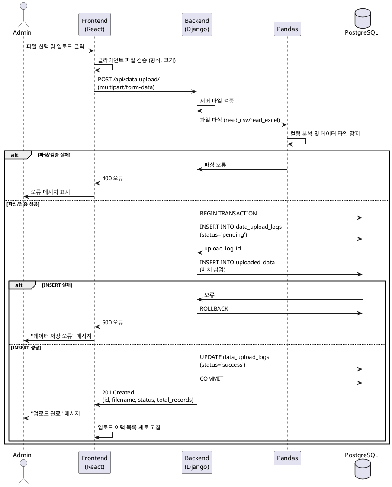

# Use Case 004: 데이터 수동 업로드

## 기본 정보

| 항목 | 내용 |
|------|------|
| **Use Case ID** | UC-004 |
| **Use Case Name** | 데이터 관리 - 수동 업로드 |
| **Primary Actor** | 관리자 |
| **Precondition** | 관리자가 로그인된 상태 (role = 'admin') |
| **Trigger** | 관리자가 '데이터 관리' 페이지에서 엑셀 파일 선택 후 '업로드' 버튼 클릭 |

---

## Main Scenario

1. 관리자가 파일 선택 입력창에서 CSV/XLSX 파일 선택
2. 클라이언트가 파일 형식 및 크기 검증 (CSV/XLSX, 50MB 이하)
3. 클라이언트가 백엔드로 multipart/form-data로 파일 전송
4. 백엔드가 파일 형식 및 크기 재검증
5. 백엔드가 Pandas로 파일 파싱 및 데이터 타입 자동 감지
   - KPI: `평가년도`, `단과대학`, `학과` 컬럼 존재
   - Publication: `논문ID`, `게재일` 컬럼 존재
   - Research: `집행ID`, `과제번호` 컬럼 존재
   - Student: `학번`, `이름` 컬럼 존재
6. 백엔드가 데이터 검증 (필수 컬럼, 데이터 타입, 범위)
7. 백엔드가 트랜잭션 시작
8. 백엔드가 data_upload_logs 테이블에 이력 기록 (status='pending')
9. 백엔드가 uploaded_data 테이블에 파싱된 데이터 배치 INSERT
10. 백엔드가 data_upload_logs 업데이트 (status='success')
11. 백엔드가 트랜잭션 커밋
12. 클라이언트가 "업로드 완료" 메시지 표시 및 이력 목록 새로 고침

---

## Edge Cases

| 시나리오 | 처리 |
|---------|------|
| 파일 미선택 | 400 오류, "파일을 선택해주세요" |
| 허용되지 않은 형식 (.txt, .pdf) | 415 오류, "CSV 또는 XLSX 파일만 업로드 가능합니다" |
| 파일 크기 50MB 초과 | 413 오류, "파일 크기가 50MB를 초과할 수 없습니다" |
| 손상된 파일 | 400 오류, "파일이 손상되었거나 올바른 형식이 아닙니다" |
| 필수 컬럼 누락 | 400 오류, "필수 컬럼이 누락되었습니다: [컬럼명]" |
| 데이터 타입 오류 | 400 오류, "행 35, 컬럼 '게재일': 올바른 날짜 형식이 아닙니다" |
| 범위 오류 | 400 오류, "행 10, 컬럼 '평가년도': 1900-2100 범위의 연도만 허용됩니다" |
| DB 트랜잭션 오류 | 500 오류, "데이터 저장 중 오류가 발생했습니다 (롤백됨)" |

---

## Business Rules

1. 관리자(role='admin')만 데이터 업로드 가능
2. 지원 파일 형식: CSV, XLSX
3. 최대 파일 크기: 50MB
4. 트랜잭션: 데이터 저장 시 원자성 보장 (all or nothing)
5. 데이터 타입 자동 감지: 파일 컬럼을 분석하여 KPI/논문/연구/학생 자동 판별
6. 기존 데이터는 유지 (새 업로드는 추가)

---

## API Specification

### Endpoint: `POST /api/data-upload/` (multipart/form-data, 관리자 전용)

**Request**
```
Content-Type: multipart/form-data

file: [binary file data]
```

**Response (201 Created)**
```json
{
  "id": 1,
  "filename": "department_kpi.csv",
  "status": "success",
  "total_records": 12,
  "processed_records": 12,
  "uploaded_at": "2025-01-15T10:30:00Z",
  "data_types": ["kpi"]
}
```

**Error Responses**

| Status | Code | Message |
|--------|------|---------|
| 400 | INVALID_FILE | 파일이 선택되지 않았습니다 |
| 415 | INVALID_FORMAT | CSV 또는 XLSX 파일만 업로드 가능합니다 |
| 413 | FILE_TOO_LARGE | 파일 크기가 50MB를 초과할 수 없습니다 |
| 400 | PARSE_ERROR | 필수 컬럼 '평가년도'가 누락되었습니다 |
| 400 | VALIDATION_ERROR | 행 35, 컬럼 '게재일': 올바른 날짜 형식이 아닙니다 |
| 500 | SERVER_ERROR | 데이터 저장 중 오류가 발생했습니다 |

---

## Database Operations

**INSERT data_upload_logs**
```sql
INSERT INTO data_upload_logs (user_id, filename, file_size, status, total_records, uploaded_at)
VALUES (%s, %s, %s, 'pending', %s, CURRENT_TIMESTAMP)
RETURNING id;
```

**INSERT uploaded_data (배치)**
```sql
INSERT INTO uploaded_data (upload_log_id, data_type, year, college, department, metadata)
VALUES (%s, %s, %s, %s, %s, %s::jsonb);
```

**UPDATE data_upload_logs (완료)**
```sql
UPDATE data_upload_logs
SET status = 'success', processed_records = %s, updated_at = CURRENT_TIMESTAMP
WHERE id = %s;
```

---

## Sequence Diagram



---

## Related Tables

- **data_upload_logs**: 업로드 이력
  - id, user_id, filename, status, total_records, processed_records
- **uploaded_data**: 업로드된 데이터
  - id, upload_log_id, data_type, year, college, department, metadata (JSONB)

---

## 데이터 타입별 필수 컬럼

### KPI (department_kpi.csv)
- 필수: 평가년도, 단과대학, 학과

### Publication (publication_list.csv)
- 필수: 논문ID, 게재일, 단과대학, 학과, 논문제목, 주저자, 학술지명

### Research (research_project_data.csv)
- 필수: 집행ID, 과제번호, 과제명, 연구책임자, 소속학과, 지원기관, 집행일자

### Student (student_roster.csv)
- 필수: 학번, 이름, 단과대학, 학과, 입학년도
