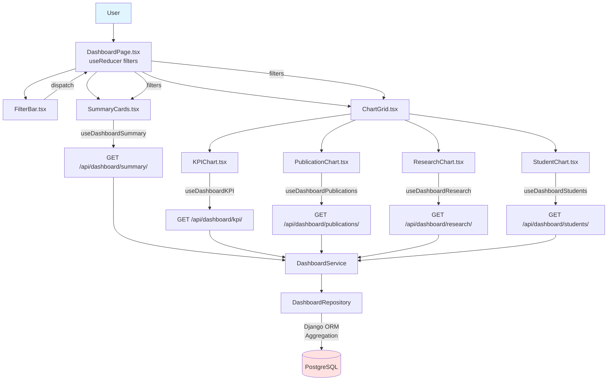

# UC-005: Main Dashboard - Implementation Plan (TDD)

## 개요

**목표**: 5개 병렬 API로 대시보드 데이터 조회, Recharts로 시각화, useReducer로 필터 관리
**방법론**: TDD (Red → Green → Refactor)
**핵심 기술**: TanStack Query (병렬 요청), Recharts, useReducer, Django Aggregation

---

## 1. Module Overview

### 1.1 Backend Modules

| 모듈 | 경로 | 역할 | 의존성 |
|------|------|------|--------|
| **DashboardSummaryView** | `apps/dashboard/views.py` | 요약 정보 API | DashboardService |
| **DashboardKPIView** | `apps/dashboard/views.py` | KPI 데이터 API | DashboardService |
| **DashboardPublicationsView** | `apps/dashboard/views.py` | 논문 데이터 API | DashboardService |
| **DashboardResearchView** | `apps/dashboard/views.py` | 연구 데이터 API | DashboardService |
| **DashboardStudentsView** | `apps/dashboard/views.py` | 학생 데이터 API | DashboardService |
| **DashboardService** | `apps/dashboard/services.py` | 데이터 집계 비즈니스 로직 | DashboardRepository |
| **DashboardRepository** | `apps/dashboard/repositories.py` | DB 조회 및 집계 | Django ORM (UploadedData) |

### 1.2 Frontend Modules

| 모듈 | 경로 | 역할 | 의존성 |
|------|------|------|--------|
| **DashboardPage** | `components/pages/DashboardPage.tsx` | 페이지 컨테이너 (useReducer 필터 관리) | FilterBar, SummaryCards, ChartGrid |
| **FilterBar** | `components/features/Dashboard/FilterBar.tsx` | 필터 UI (연도, 학기, 단과대학) | dashboardReducer (props) |
| **SummaryCards** | `components/features/Dashboard/SummaryCards.tsx` | 요약 통계 카드 | useDashboardSummary hook |
| **ChartGrid** | `components/features/Dashboard/ChartGrid.tsx` | 차트 컨테이너 | KPIChart, PublicationChart, ResearchChart, StudentChart |
| **KPIChart** | `components/features/Dashboard/KPIChart.tsx` | KPI 막대 그래프 | useDashboardKPI hook, Recharts |
| **PublicationChart** | `components/features/Dashboard/PublicationChart.tsx` | 논문 라인 차트 | useDashboardPublications hook |
| **useDashboard Hooks** | `hooks/queries/useDashboard.ts` | 5개 API TanStack Query hooks | TanStack Query |

---

## 2. Dependency Diagram



---

## 3. TDD Implementation Order

### Phase 1: Backend - DashboardRepository (DB 집계)
### Phase 2: Backend - DashboardService (집계 로직)
### Phase 3: Backend - DashboardViews (5개 API Endpoints)
### Phase 4: Frontend - dashboardReducer (필터 상태 관리)
### Phase 5: Frontend - useDashboard Hooks (TanStack Query)
### Phase 6: Frontend - Chart Components (Recharts)
### Phase 7: E2E Tests (Full Flow)

---

## 4. Phase 1: Backend - DashboardRepository

### 4.1 Test Scenarios (Unit Tests)

```python
# path: backend/apps/dashboard/tests/test_repositories.py

import pytest
from datetime import datetime

from apps.data_upload.models import UploadedData, DataUploadLog
from apps.core.tests.factories import UserFactory
from ..repositories import DashboardRepository

@pytest.fixture
def sample_kpi_data(db):
    """KPI 테스트 데이터"""
    user = UserFactory()
    log = DataUploadLog.objects.create(user=user, filename='test.csv', status='success')

    UploadedData.objects.bulk_create([
        UploadedData(
            upload_log=log,
            data_type='kpi',
            year=2025,
            semester='1',
            college='공과대학',
            department='컴퓨터공학과',
            metadata={'취업률': 88.5, '전임교원': 17}
        ),
        UploadedData(
            upload_log=log,
            data_type='kpi',
            year=2025,
            semester='2',
            college='인문대학',
            department='철학과',
            metadata={'취업률': 65.0, '전임교원': 6}
        )
    ])

    return log

def test_get_kpi_data_all_semesters(sample_kpi_data):
    # Given
    repository = DashboardRepository()

    # When
    result = repository.get_kpi_data(year=2025, semester='all')

    # Then
    assert len(result) == 2
    assert result[0]['department'] == '컴퓨터공학과'
    assert result[0]['graduation_rate'] == 88.5

def test_get_kpi_data_specific_semester(sample_kpi_data):
    # Given
    repository = DashboardRepository()

    # When
    result = repository.get_kpi_data(year=2025, semester='1')

    # Then
    assert len(result) == 1
    assert result[0]['college'] == '공과대학'
```

### 4.2 Implementation (DashboardRepository)

```python
# path: backend/apps/dashboard/repositories.py

from typing import List, Dict, Any
from django.db.models import Count, Q

from apps.data_upload.models import UploadedData

class DashboardRepository:
    """
    대시보드 데이터 조회 및 집계
    """

    def get_kpi_data(self, year: int, semester: str = 'all') -> List[Dict[str, Any]]:
        """KPI 데이터 조회"""
        queryset = UploadedData.objects.filter(
            data_type='kpi',
            year=year
        )

        if semester != 'all':
            queryset = queryset.filter(semester=semester)

        results = []
        for record in queryset:
            results.append({
                'college': record.college,
                'department': record.department,
                'graduation_rate': record.metadata.get('취업률', 0),
                'tenured_faculty': record.metadata.get('전임교원', 0),
                'visiting_faculty': record.metadata.get('시간강사', 0)
            })

        return results

    def get_publication_trends(self, year: int) -> List[Dict[str, Any]]:
        """논문 발행 추이 (최근 3년)"""
        # JSONB 필드에서 year 추출 및 그룹화 로직
        pass

    def get_summary_stats(self, year: int, semester: str, college: str) -> Dict[str, Any]:
        """요약 통계"""
        # 전체 집계 로직
        pass
```

---

## 5. Phase 2: Backend - DashboardService

### 5.1 Test Scenarios (Unit Tests)

```python
# path: backend/apps/dashboard/tests/test_services.py

import pytest
from unittest.mock import MagicMock

from ..services import DashboardService

@pytest.fixture
def mock_repository():
    repo = MagicMock()
    repo.get_kpi_data.return_value = [
        {'college': '공과대학', 'department': '컴퓨터공학과', 'graduation_rate': 88.5}
    ]
    return repo

def test_get_kpi_dashboard_data(mock_repository):
    # Given
    service = DashboardService()
    service.repository = mock_repository

    # When
    result = service.get_kpi_dashboard(year=2025, semester='all')

    # Then
    assert 'data' in result
    assert len(result['data']) == 1
    mock_repository.get_kpi_data.assert_called_once_with(year=2025, semester='all')
```

---

## 6. Phase 3: Backend - DashboardViews (E2E)

### 6.1 Test Scenarios (E2E Tests)

```python
# path: backend/apps/dashboard/tests/test_views.py

import pytest
from django.urls import reverse
from rest_framework import status

from apps.core.tests.factories import UserFactory

@pytest.mark.django_db
class TestDashboardAPIs:
    """
    Dashboard API E2E 테스트 (NO MOCKING)
    """

    def test_get_dashboard_summary(self, api_client, sample_kpi_data):
        # Given
        user = UserFactory(is_active=True)
        api_client.force_authenticate(user=user)

        url = reverse('dashboard-summary')

        # When
        response = api_client.get(url, {'year': 2025, 'semester': 'all', 'college': 'all'})

        # Then
        assert response.status_code == status.HTTP_200_OK
        assert 'summary' in response.data
        assert 'total_students' in response.data['summary']

    def test_get_dashboard_kpi(self, api_client, sample_kpi_data):
        # Given
        user = UserFactory()
        api_client.force_authenticate(user=user)

        url = reverse('dashboard-kpi')

        # When
        response = api_client.get(url, {'year': 2025, 'semester': '1'})

        # Then
        assert response.status_code == status.HTTP_200_OK
        assert 'data' in response.data
        assert len(response.data['data']) > 0
```

### 6.2 Implementation (DashboardViews)

```python
# path: backend/apps/dashboard/views.py

from rest_framework.views import APIView
from rest_framework.response import Response
from rest_framework.permissions import IsAuthenticated

from .services import DashboardService

class DashboardKPIView(APIView):
    """
    GET /api/dashboard/kpi/

    KPI 데이터 조회
    """
    permission_classes = [IsAuthenticated]

    def get(self, request):
        service = DashboardService()

        year = int(request.query_params.get('year', 2025))
        semester = request.query_params.get('semester', 'all')

        result = service.get_kpi_dashboard(year=year, semester=semester)
        return Response(result)
```

---

## 7. Phase 4: Frontend - dashboardReducer

### 7.1 Test Scenarios (Unit Tests)

```typescript
// path: frontend/src/reducers/dashboardReducer.test.ts

import { describe, test, expect } from 'vitest';
import { dashboardReducer, initialState } from './dashboardReducer';

describe('dashboardReducer', () => {
  test('CHANGE_YEAR 액션으로 연도 변경', () => {
    const action = { type: 'CHANGE_YEAR' as const, payload: 2024 };

    const newState = dashboardReducer(initialState, action);

    expect(newState.filters.year).toBe(2024);
  });

  test('CHANGE_SEMESTER 액션으로 학기 변경', () => {
    const action = { type: 'CHANGE_SEMESTER' as const, payload: '1' as const };

    const newState = dashboardReducer(initialState, action);

    expect(newState.filters.semester).toBe('1');
  });

  test('RESET_FILTERS 액션으로 필터 초기화', () => {
    const modifiedState = {
      filters: { year: 2020, semester: '1' as const, college: '공과대학' }
    };

    const action = { type: 'RESET_FILTERS' as const };
    const newState = dashboardReducer(modifiedState, action);

    expect(newState.filters.year).toBe(new Date().getFullYear());
    expect(newState.filters.semester).toBe('all');
  });
});
```

### 7.2 Implementation (dashboardReducer)

```typescript
// path: frontend/src/reducers/dashboardReducer.ts

export interface DashboardFilters {
  year: number;
  semester: 'all' | '1' | '2';
  college: string;
}

export interface DashboardState {
  filters: DashboardFilters;
}

export type DashboardAction =
  | { type: 'CHANGE_YEAR'; payload: number }
  | { type: 'CHANGE_SEMESTER'; payload: 'all' | '1' | '2' }
  | { type: 'CHANGE_COLLEGE'; payload: string }
  | { type: 'RESET_FILTERS' };

export const initialState: DashboardState = {
  filters: {
    year: new Date().getFullYear(),
    semester: 'all',
    college: 'all',
  },
};

export function dashboardReducer(state: DashboardState, action: DashboardAction): DashboardState {
  switch (action.type) {
    case 'CHANGE_YEAR':
      return { ...state, filters: { ...state.filters, year: action.payload } };

    case 'CHANGE_SEMESTER':
      return { ...state, filters: { ...state.filters, semester: action.payload } };

    case 'CHANGE_COLLEGE':
      return { ...state, filters: { ...state.filters, college: action.payload } };

    case 'RESET_FILTERS':
      return initialState;

    default:
      return state;
  }
}
```

---

## 8. Phase 5: Frontend - useDashboard Hooks

### 8.1 Test Scenarios (Unit Tests with MSW)

```typescript
// path: frontend/src/hooks/queries/useDashboard.test.ts

import { renderHook, waitFor } from '@testing-library/react';
import { QueryClient, QueryClientProvider } from '@tanstack/react-query';
import { http, HttpResponse } from 'msw';
import { server } from '@/mocks/server';
import { useDashboardKPI } from './useDashboard';

const createWrapper = () => {
  const queryClient = new QueryClient({ defaultOptions: { queries: { retry: false } } });
  return ({ children }: { children: React.ReactNode }) => (
    <QueryClientProvider client={queryClient}>{children}</QueryClientProvider>
  );
};

test('KPI 데이터 조회 성공', async () => {
  // Given: MSW로 성공 응답
  server.use(
    http.get('/api/dashboard/kpi/', () => {
      return HttpResponse.json({
        data: [
          { college: '공과대학', department: '컴퓨터공학과', graduation_rate: 88.5 }
        ]
      });
    })
  );

  // When
  const { result } = renderHook(() => useDashboardKPI({ year: 2025, semester: 'all' }), {
    wrapper: createWrapper()
  });

  // Then
  await waitFor(() => expect(result.current.isSuccess).toBe(true));
  expect(result.current.data?.data).toHaveLength(1);
  expect(result.current.data?.data[0].department).toBe('컴퓨터공학과');
});
```

### 8.2 Implementation (useDashboard Hooks)

```typescript
// path: frontend/src/hooks/queries/useDashboard.ts

import { useQuery } from '@tanstack/react-query';
import apiClient from '@/api/client';
import type { DashboardFilters } from '@/reducers/dashboardReducer';

export const useDashboardKPI = (filters: DashboardFilters) => {
  return useQuery({
    queryKey: ['dashboard', 'kpi', filters],
    queryFn: async () => {
      const params = new URLSearchParams({
        year: String(filters.year),
        semester: filters.semester,
      });
      const response = await apiClient.get(`/api/dashboard/kpi/?${params}`);
      return response.data;
    },
    staleTime: 5 * 60 * 1000, // 5분
  });
};

// 나머지 hooks (useDashboardSummary, useDashboardPublications 등) 동일 패턴
```

---

## 9. Phase 6: Frontend - Chart Components

### 9.1 Test Scenarios (Component Tests)

```typescript
// path: frontend/src/components/features/Dashboard/KPIChart.test.tsx

import { render, screen, waitFor } from '@testing-library/react';
import { QueryClient, QueryClientProvider } from '@tanstack/react-query';
import { http, HttpResponse } from 'msw';
import { server } from '@/mocks/server';
import { KPIChart } from './KPIChart';

test('KPI 데이터가 로딩되면 차트를 렌더링한다', async () => {
  // Given: MSW로 데이터 제공
  server.use(
    http.get('/api/dashboard/kpi/', () => {
      return HttpResponse.json({
        data: [
          { college: '공과대학', department: '컴퓨터공학과', graduation_rate: 88.5, tenured_faculty: 17 }
        ]
      });
    })
  );

  const queryClient = new QueryClient();
  const filters = { year: 2025, semester: 'all' as const, college: 'all' };

  // When
  render(
    <QueryClientProvider client={queryClient}>
      <KPIChart filters={filters} />
    </QueryClientProvider>
  );

  // Then: 로딩 후 차트 표시
  expect(screen.getByRole('progressbar')).toBeInTheDocument();  // 로딩 스피너
  await waitFor(() => expect(screen.queryByRole('progressbar')).not.toBeInTheDocument());
  expect(screen.getByText(/컴퓨터공학과/i)).toBeInTheDocument();
});
```

### 9.2 Implementation (KPIChart)

```typescript
// path: frontend/src/components/features/Dashboard/KPIChart.tsx

import { CircularProgress, Alert } from '@mui/material';
import { BarChart, Bar, XAxis, YAxis, Tooltip, Legend, ResponsiveContainer } from 'recharts';
import { useDashboardKPI } from '@/hooks/queries/useDashboard';
import type { DashboardFilters } from '@/reducers/dashboardReducer';

interface KPIChartProps {
  filters: DashboardFilters;
}

export const KPIChart = ({ filters }: KPIChartProps) => {
  const { data, isLoading, error } = useDashboardKPI(filters);

  if (isLoading) return <CircularProgress />;
  if (error) return <Alert severity="error">데이터를 불러오는 중 오류가 발생했습니다</Alert>;
  if (!data || data.data.length === 0) return <Alert severity="info">표시할 데이터가 없습니다</Alert>;

  return (
    <ResponsiveContainer width="100%" height={300}>
      <BarChart data={data.data}>
        <XAxis dataKey="department" />
        <YAxis />
        <Tooltip />
        <Legend />
        <Bar dataKey="graduation_rate" fill="#8884d8" name="취업률" />
        <Bar dataKey="tenured_faculty" fill="#82ca9d" name="전임교원" />
      </BarChart>
    </ResponsiveContainer>
  );
};
```

---

## 10. Implementation Checklist

### Backend
- [ ] DashboardRepository 단위 테스트 작성 (KPI, Summary, Publications)
- [ ] DashboardRepository 구현 (Django ORM 집계)
- [ ] DashboardService 단위 테스트 작성
- [ ] DashboardService 구현
- [ ] DashboardViews E2E 테스트 작성 (5개 API)
- [ ] DashboardViews 구현 (Summary, KPI, Publications, Research, Students)
- [ ] URL 라우팅 설정

### Frontend
- [ ] dashboardReducer 단위 테스트 작성 (4개 액션)
- [ ] dashboardReducer 구현
- [ ] useDashboard hooks 단위 테스트 작성 (5개 hooks)
- [ ] useDashboard hooks 구현 (TanStack Query)
- [ ] KPIChart 컴포넌트 테스트 작성
- [ ] KPIChart 컴포넌트 구현 (Recharts)
- [ ] PublicationChart, ResearchChart, StudentChart 구현
- [ ] FilterBar 컴포넌트 구현
- [ ] DashboardPage 구현 (useReducer + URL 동기화)
- [ ] E2E 테스트 작성 (Playwright)

### Infrastructure
- [ ] MSW handlers 설정 (5개 dashboard APIs)
- [ ] Sample dashboard data factories

---

## 11. Test Coverage Goal

- **Backend Unit Tests**: 80%+ (Repository, Service)
- **Backend E2E Tests**: 100% (5개 Dashboard APIs)
- **Frontend Unit Tests**: 80%+ (dashboardReducer, useDashboard hooks)
- **Frontend Component Tests**: 80%+ (Charts)
- **Frontend E2E Tests**: 100% (대시보드 필터링 플로우)

---

## 12. Notes

- **병렬 요청**: TanStack Query가 자동으로 5개 API를 병렬 실행
- **캐싱**: staleTime 5분 설정으로 불필요한 재요청 방지
- **URL 동기화**: useEffect로 filters 변경 시 URL 업데이트
- **Recharts**: 반응형 차트 (ResponsiveContainer)
