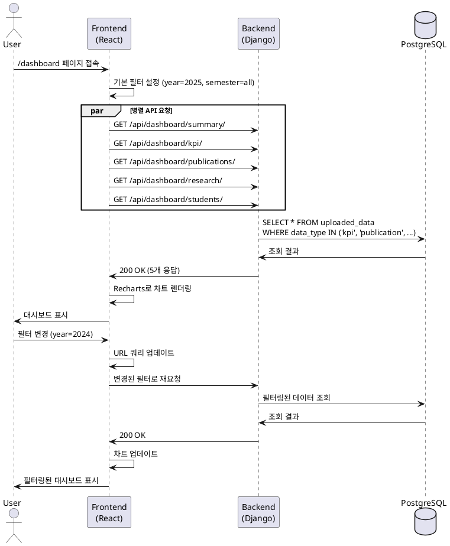

# Use Case 005: 메인 대시보드 조회

## 기본 정보

| 항목 | 내용 |
|------|------|
| **Use Case ID** | UC-005 |
| **Use Case Name** | 메인 대시보드 조회 및 필터링 |
| **Primary Actor** | 사용자 (관리자, 일반 사용자) |
| **Precondition** | 사용자가 로그인된 상태 (유효한 Access Token 보유) |
| **Trigger** | 사용자가 '/dashboard' 페이지 접속 또는 필터 값 변경 |

---

## Main Scenario

1. 사용자가 대시보드 페이지('/dashboard') 접속
2. 시스템이 기본 필터 설정 (현재 연도, 전체 학기)
3. 시스템이 Access Token 유효성 검증
4. 클라이언트가 병렬로 5개 API 요청
   - 대시보드 요약 정보
   - KPI 데이터
   - 논문 데이터
   - 연구 프로젝트 데이터
   - 학생 데이터
5. 백엔드가 uploaded_data 테이블에서 필터링된 데이터 조회
6. 백엔드가 각 데이터 타입별로 집계 및 가공
7. 클라이언트가 Recharts로 차트 렌더링
   - KPI: 막대 그래프
   - 논문: 라인 차트 (연도별 추이)
   - 연구: 원형/막대 차트
   - 학생: 통계 카드
8. 사용자가 필터 변경 (연도, 학기, 단과대학)
9. 시스템이 URL 쿼리 파라미터 업데이트
10. 시스템이 변경된 필터로 데이터 재요청 및 차트 업데이트

---

## Edge Cases

| 시나리오 | 처리 |
|---------|------|
| 업로드된 데이터 없음 | 모든 차트에 "표시할 데이터가 없습니다" 메시지 |
| 필터 조건에 데이터 없음 | 해당 차트만 "데이터 없음" 상태 표시 |
| DB 조회 오류 | "데이터를 불러오는 중 오류가 발생했습니다" + 재시도 버튼 |
| 네트워크 연결 끊김 | 자동 재시도 또는 재시도 버튼 |
| Access Token 만료 | Refresh Token으로 갱신 후 재요청 |

---

## Business Rules

1. 인증 필수: 유효한 토큰 없이 접근 불가
2. 기본 필터: 현재 연도, 전체 학기
3. 데이터 캐싱: TanStack Query 캐싱 (staleTime: 5분)
4. 백그라운드 갱신: 5분 후 자동 재요청
5. URL 동기화: 필터 상태를 URL 쿼리로 관리
6. 응답 속도: API 응답 < 2초 목표

---

## API Specification

### Endpoint 1: `GET /api/dashboard/summary/`

**Request**
```
GET /api/dashboard/summary/?year=2025&semester=all&college=all
```

**Response (200 OK)**
```json
{
  "year": 2025,
  "summary": {
    "total_students": 1200,
    "total_faculty": 150,
    "total_publications": 45,
    "total_budget": 5000000000
  }
}
```

---

### Endpoint 2: `GET /api/dashboard/kpi/`

**Request**
```
GET /api/dashboard/kpi/?year=2025&semester=all
```

**Response (200 OK)**
```json
{
  "data": [
    {
      "college": "공과대학",
      "department": "컴퓨터공학과",
      "graduation_rate": 88.0,
      "tenured_faculty": 17,
      "visiting_faculty": 5
    }
  ]
}
```

---

### Endpoint 3: `GET /api/dashboard/publications/`

**Request**
```
GET /api/dashboard/publications/?year=2025
```

**Response (200 OK)**
```json
{
  "data": [
    {"year": 2023, "total": 8, "scie": 4, "kci": 4},
    {"year": 2024, "total": 9, "scie": 5, "kci": 4},
    {"year": 2025, "total": 10, "scie": 6, "kci": 4}
  ]
}
```

---

### Endpoint 4: `GET /api/dashboard/research/`

**Request**
```
GET /api/dashboard/research/?year=2025
```

**Response (200 OK)**
```json
{
  "data": {
    "total_projects": 8,
    "total_budget": 1680000000,
    "executed": 630500000,
    "by_status": {
      "집행완료": 5,
      "처리중": 1
    }
  }
}
```

---

### Endpoint 5: `GET /api/dashboard/students/`

**Request**
```
GET /api/dashboard/students/?year=2025
```

**Response (200 OK)**
```json
{
  "data": {
    "total": 1200,
    "by_degree": {"학사": 950, "석사": 200, "박사": 50},
    "by_status": {"재학": 1150, "휴학": 30}
  }
}
```

---

**Error Responses**

| Status | Code | Message |
|--------|------|---------|
| 401 | UNAUTHORIZED | 인증이 필요합니다 |
| 400 | INVALID_FILTER | 유효하지 않은 필터입니다 |
| 500 | SERVER_ERROR | 데이터를 불러오는 중 오류가 발생했습니다 |

---

## Database Operations

**KPI 데이터 조회**
```sql
SELECT college, department, metadata
FROM uploaded_data
WHERE data_type = 'kpi'
  AND year = %s
  AND (semester = %s OR %s = 'all')
ORDER BY college, department;
```

**논문 데이터 조회**
```sql
SELECT
  EXTRACT(YEAR FROM (metadata->>'publication_date')::date) as year,
  COUNT(*) as total,
  COUNT(CASE WHEN metadata->>'journal_level' = 'SCIE' THEN 1 END) as scie
FROM uploaded_data
WHERE data_type = 'publication'
GROUP BY year
ORDER BY year;
```

---

## Sequence Diagram



---

## Related Tables

- **uploaded_data**: 모든 업로드된 데이터
  - data_type, year, semester, college, department, metadata (JSONB)
