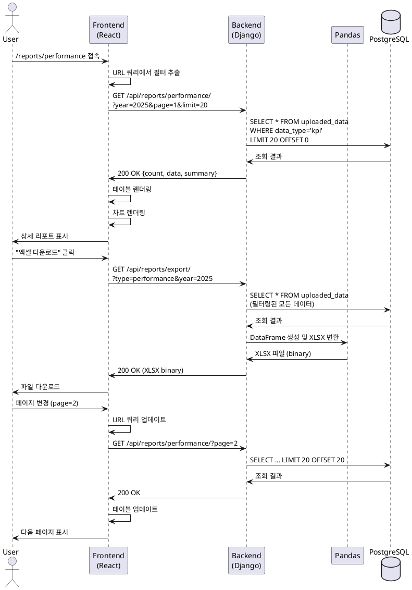

# Use Case 006: 상세 리포트 조회

## 기본 정보

| 항목 | 내용 |
|------|------|
| **Use Case ID** | UC-006 |
| **Use Case Name** | 상세 리포트 조회 및 필터링 |
| **Primary Actor** | 사용자 (관리자, 일반 사용자) |
| **Precondition** | 사용자가 로그인된 상태 (유효한 Access Token 보유) |
| **Trigger** | 사용자가 대시보드 차트 클릭 또는 직접 URL로 상세 리포트 페이지 접속 |

---

## Main Scenario

1. 사용자가 상세 리포트 페이지 접속
   - URL: `/reports/{report_type}?filters`
   - report_type: performance, publications, research, students
2. 시스템이 URL 쿼리 파라미터에서 필터 추출
3. 시스템이 기본 필터 설정 (현재 연도, 페이지=1, limit=20)
4. 클라이언트가 리포트 데이터 API 요청
5. 백엔드가 uploaded_data 테이블에서 필터링 및 페이지네이션 적용하여 조회
6. 백엔드가 데이터와 통계 정보 반환
7. 클라이언트가 테이블과 상세 차트 렌더링
8. 사용자가 필터 변경, 정렬, 또는 페이지 이동
9. 시스템이 URL 업데이트 및 데이터 재요청
10. 사용자가 "엑셀 다운로드" 버튼 클릭
11. 백엔드가 Pandas로 XLSX 파일 생성
12. 클라이언트가 파일 다운로드

---

## Edge Cases

| 시나리오 | 처리 |
|---------|------|
| 필터 조건에 데이터 없음 | "검색 결과가 없습니다. 필터 조건을 변경해주세요" |
| 잘못된 report_type | 404 오류 또는 기본 리포트(performance) 표시 |
| DB 조회 오류 | "데이터를 불러오는 중 오류가 발생했습니다" + 재시도 버튼 |
| 대용량 데이터 | 페이지네이션으로 분할, 스켈레톤 로더 표시 |
| 엑셀 다운로드 실패 | "파일 생성 중 오류가 발생했습니다" + 재시도 버튼 |
| 네트워크 연결 끊김 | 자동 재시도 또는 재시도 버튼 |

---

## Business Rules

1. 인증 필수: 유효한 토큰 없이 접근 불가
2. 페이지네이션: 기본 20행/페이지
3. 정렬: 기본 정렬은 생성 날짜 내림차순
4. 엑셀 형식: XLSX, UTF-8 인코딩
5. URL 동기화: 필터와 페이지 상태를 URL로 관리
6. 응답 시간: API 응답 < 3초 목표

---

## API Specification

### Endpoint 1: `GET /api/reports/performance/`

**Request**
```
GET /api/reports/performance/?year=2025&college=all&page=1&limit=20
```

**Response (200 OK)**
```json
{
  "count": 8,
  "page": 1,
  "limit": 20,
  "data": [
    {
      "id": 1,
      "year": 2025,
      "college": "공과대학",
      "department": "컴퓨터공학과",
      "graduation_rate": 88.0,
      "tenured_faculty": 17
    }
  ],
  "summary": {
    "avg_graduation_rate": 79.1,
    "total_faculty": 48
  }
}
```

---

### Endpoint 2: `GET /api/reports/publications/`

**Request**
```
GET /api/reports/publications/?year=2025&college=all&page=1&limit=20
```

**Response (200 OK)**
```json
{
  "count": 10,
  "data": [
    {
      "paper_id": "PUB-25-001",
      "publication_date": "2025-06-15",
      "paper_title": "Federated Learning...",
      "first_author": "이서연",
      "journal_level": "SCIE"
    }
  ]
}
```

---

### Endpoint 3: `GET /api/reports/research/`

**Request**
```
GET /api/reports/research/?year=2025&status=all&page=1&limit=20
```

**Response (200 OK)**
```json
{
  "count": 8,
  "data": [
    {
      "project_number": "NRF-2025-002",
      "project_name": "고대 철학 텍스트...",
      "researcher_in_charge": "최은경",
      "total_budget": 80000000,
      "status": "집행완료"
    }
  ]
}
```

---

### Endpoint 4: `GET /api/reports/students/`

**Request**
```
GET /api/reports/students/?year=2025&department=all&page=1&limit=20
```

**Response (200 OK)**
```json
{
  "count": 9,
  "data": [
    {
      "student_id": "20201101",
      "name": "김유진",
      "department": "컴퓨터공학과",
      "grade": 4,
      "degree_type": "학사",
      "academic_status": "재학"
    }
  ]
}
```

---

### Endpoint 5: `GET /api/reports/export/` (엑셀 다운로드)

**Request**
```
GET /api/reports/export/?type=performance&year=2025&college=all
```

**Response (200 OK)**
```
Content-Type: application/vnd.openxmlformats-officedocument.spreadsheetml.sheet
Content-Disposition: attachment; filename="performance_2025_20250115.xlsx"

[Binary XLSX file]
```

---

**Error Responses**

| Status | Code | Message |
|--------|------|---------|
| 401 | UNAUTHORIZED | 인증이 필요합니다 |
| 400 | INVALID_FILTER | 유효하지 않은 필터입니다 |
| 404 | NOT_FOUND | 검색 결과가 없습니다 |
| 500 | SERVER_ERROR | 데이터를 불러오는 중 오류가 발생했습니다 |

---

## Database Operations

**페이지네이션 쿼리**
```sql
SELECT id, year, college, department, metadata
FROM uploaded_data
WHERE data_type = %s
  AND year = %s
  AND (college = %s OR %s = 'all')
ORDER BY created_at DESC
LIMIT %s OFFSET %s;
```

**카운트 쿼리**
```sql
SELECT COUNT(*) FROM uploaded_data
WHERE data_type = %s AND year = %s;
```

---

## Sequence Diagram



---

## Related Tables

- **uploaded_data**: 업로드된 모든 데이터
  - data_type, year, college, department, metadata (JSONB)
